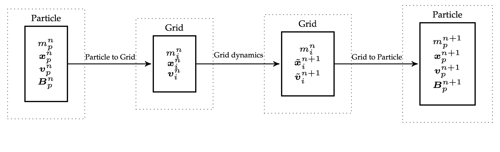

# APIC - Affine Particle-In-Cell

APIC is another hybrid Lagrange-Euler method that improves upon FLIP. 

A Lagrangian/Eulerian hybrid simulation time step follows a similar pattern regardless of whether one is simulating fluids with incompressible [[FLIP - Animating sand as fluid]] or solids with [[MPM and Hybrid Euler - Lagrange simulations]]. 

Abstractly, *kinematic steps are done on particles* and *dynamic steps are done on the grid.*

Hybrid particle-grid methods like PIC (Particle-In-Cell) and FLIP (Fluid Implicit Particle) come with tradeoffs:

- **PIC** is stable but overly *dissipative* (i.e., loses kinetic and angular energy).
	- e.g. $L_{TOT}$ is not conserved
- **FLIP** preserves energy better but introduces **instabilities** (especially noise and “ringing”).

> [!Note] Main observation is that
> these issues largely arise from **information loss during particle-grid transfers**.

Key differences between all these methods lie in **grid ↔ particle transfer**:

- **PIC**: full filtering → stability, but loss of energy.
- **FLIP**: adds grid increments → less dissipation, but unstable.
- **APIC**: like PIC, but adds local affine matrix per particle to avoid loss. That is, it represents velocity locally as **affine** (not constant).

**PIC recall:**

$$ m_i v_i = \sum_p w_{ip}m_p v_p$$
$$v_p = \sum_i w_{ip}\tilde{v_i}$$
Again, in PIC, **Linear momentum** conserved, but **angular momentum is not** → rotation damping.

Now we will discuss the 2 methods they proposed to address this problem.

### RPIC

While mutliple grid nodes can store angular momentum, a single particle can't, so the information is lost in the transfer.

> Fix the **angular momentum loss** in PIC by **augmenting each particle with angular momentum** $L_p$​, capturing rigid rotational motion, and inertia $K_p$.

In RPIC, particles are treated like **tiny rigid bodies**:

- Each stores **linear velocity** 
- And **angular momentum** 
- The particle velocity at a nearby grid node becomes:

$$v_i = v_p + \omega_p \times (x_i - x_p)$$
where $\omega_p  = K_{p}^{-1} L_p$. Note that in classic mechanics we compute:

$$I = \sum_j m_j r_j^{*} {r_j^{*}}^\top$$
but during the transfer we have to weight the mass of each node by $w_{j,p}$ . Since $r_j = (x_j - x_p)$ we get:

$$K_p =\sum_j w_{jp}m_p (x_j - x_p)^* (x_j-x_p)^{*\top}.$$
With this out of the way we can formalize the transfer:

**P2G**

1. Grid mass: $m_i = \sum_p w_{ip}m_p$
2. Inertia: $K_p = \sum_j w_{jp}m_p (x_j -x_p)^{*}(x_j - x_p)^{*\top}$
3. Momentum: $m_iv_i = \sum_p w_{ip}m_p [v_p + (K_p^{-1}L_p)\times (x_i - x_p)]$

> One may imagine this transfer as distributing the masses $w_{ip}m_p$ from the rigid body to the grid node i.

**G2P**:

1. Update velocity: $v_p = \sum_i w_{ip}\tilde v_i$
2. $L_p = \sum_i w_{ip}(x_i - x_p)\times m_p\tilde{v_i}$

This gives the total conserved angular momentum of particles:

$$L_{TOT}^{P,n} = \sum_p (x_p \times m_pv_p + L_p^n)$$

####  Guarantees

- Preserves **rigid motion** fields (Prop. 4.1)
- Conserves **linear** (Props. 4.2–4.3) and **angular momentum** (Props. 4.4–4.5)

Okay, so why do we need anything else? Well, RPIC still **doesn't capture shear/stretch**, i.e., only rigid rotation is encoded. That’s what leads us to APIC.

##  APIC

RPIC only handles rigid rotation, not **shear/stretch**. APIC introduces **local affine velocity field** per particle to capture **shear, scale, and more general local flow**.

Instead of representing each particle's $v_p$ as a **constant vector**, APIC represents it as a **locally affine velocity field:**

$$v(x) = v_p + C_p (x-x_p)$$

where $C_p$ should capture local velocity derivatives (including rotation, shear, etc.). We define:

$$C_p = B_p D_p^{-1}$$

Rather than explicitly trying to conserve angular momentum in the transfer from grid to particles, we seek to preserve affine velocity fields across both transfers. It turns out this also conserves angular momentum!

**P2G.** 

- momentum tensor: $D_p = \sum_i w_{ip}(x_i-x_p)(x_i-x_p)^\top$
- momentum: $m_i v_i = \sum_p w_{ip}m_p (v_p + B_pD_{p}^{-1}(x_i - x_p))$

The expression for $D_p^n$ is derived by preserving affine motion during the transfers.

**G2P.**

- Transfer velocity: $v_p = \sum_i w_{ip}\tilde{v_i}$
- Compute affine matrix: $B_p =\sum_i w_{ip}\tilde{v_i}(x_i - x_p)^\top$

For intuition, we can think about:

- $D_p$ captures local geometry / distribution of grid points that influence the particle.
- $B_p$ stores the grid velocity variation observed at grid nodes around the particles (local velocity variation). It encodes both **translational** and **rotational** components of motion.

**Note:** skew-symmetric part of $B_p^n$ contains all ang. mom. information (encodes rotation, just like $L_p$). As such it seems to be analogous to $L_p^n = K_p^n \omega_p^n$, since $B_p^n = C_p^n D_p^n$. We see that $D_p$ is analogous to the inertia tensor.

- For common **[[Interpolation stencils]]** used in MPM, $\mathbf{D}_p^n$ simplifies to scaled identity matrices:
  - **Quadratic stencil:** $\mathbf{D}_p^n = \frac{1}{4} \Delta x^2 \mathbf{I}$
  - **Cubic stencil:** $\mathbf{D}_p^n = \frac{1}{3} \Delta x^2 \mathbf{I}$

- Since these are scalar multiples of the identity, their inverse is trivial:
  $$(\mathbf{D}_p^n)^{-1} = \frac{1}{c \Delta x^2} \mathbf{I}$$
  for a known constant $c$. So, **no matrix inversion is actually needed**.

- For **trilinear interpolation**, however, $\mathbf{D}_p^n$ can be **singular** if the particle lies exactly on a grid face, edge, or node.

- But, there's a key identity that avoids this problem entirely:
  $$w_{ip} (\mathbf{D}_p^n)^{-1} (\mathbf{x}_i - \mathbf{x}_p) = \nabla w_{ip}$$
  This means **you never need to explicitly compute or invert $\mathbf{D}_p^n$** when using [[Trilinear interpolation]].

>We show that angular momentum is conserved during the transfer from grid to particle in a supplementary document.

## Fluids (MAC grids)

Similar to FLIP and PIC, we want to use APIC for fluid simulation, so we formulate a set of transfers between particles and MAC faces.

Besides a velocity, each particle stores $c_{pa}$ for each grid direction $(x,y,z)$ (instead of the whole $B_p$).

We perform the **P2G (face transfer):**

1. Mass: $m_{ai} = \sum_p m_p w_{aip}$
2. Momentum: $m_{ai}v_{ai} = \sum_p m_p w_{aip}(e_a^\top v_p + c_{pa}^\top (x_{ai}-x_p))$

**G2P:**

1. Velocity: $v_p = \sum_{a,i} w_{aip} \tilde{v_{ai}} e_a$
2. Affine $c$: $c_{pa} = \sum_i \nabla w_{aip}\tilde{v_{ai}}$

This allows us to recover the velocity from the grid in all directions $(x,y,z)$. Above the weights are just $w_{aip} = N(x_{ai} -x_p)$, where $N$ is [[Trilinear interpolation]].

Incompressibility is forced on the standard way.

## Lagrangian Forces
We can use APIC in MPM force computation, that is how to couple MPM with Lagrangian meshes. 

The question is how do we apply $f$ to grid? We can relate $x_p$ to "moving grid nodes" $x_i$ so that we can eval forces $f_i$ from $f_p$.

The idea is to apply forces defined on particles, but we route them through the grid for consistency and collisions:

1. Assume we have some potential energy $\Phi(x_p)$ over particles
2. Then $f_p = - \partial_{x_p}\Phi$
3. Applied to grid nodes $f_i = \sum_p w_{ip}f_p$
4. (implicit integration) can linearize:
	1. $\delta f_p = \sum_q \partial_{x_q}f_p \delta u_q$
	2. $\delta f_i = \sum_{p,q,j}w_{ip}\partial_{x_q}f_p w_{jq}\delta u_j$
Since these forces are applied to the grid, both the MPM and Lagrangian approaches can be employed in the same simulation. Each particle is labeled as an MPM particle or a meshed particle.

| Method | Dissipation | Stability | Angular Momentum | Noise   |
| ------ | ----------- | --------- | ---------------- | ------- |
| PIC    | High        | ✅ Stable  | ❌ Lost           | ✅ Clean |
| FLIP   | ❌ Low       | ❌ Noisy   | ✅ Better         | ❌ Noisy |
| APIC   | ✅ Low       | ✅ Stable  | ✅ Conserved      | ✅ Clean |
