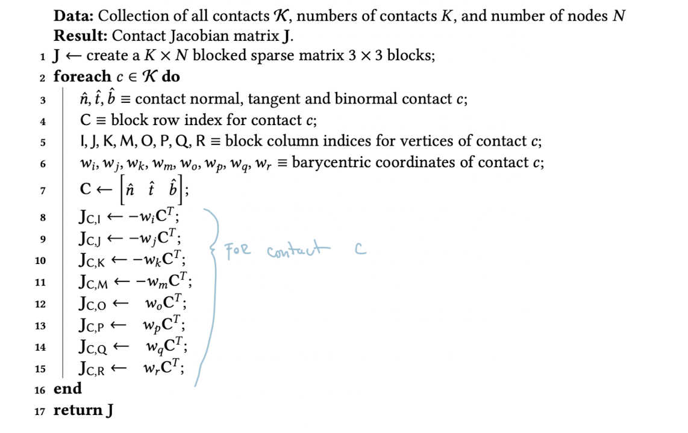

# Contact Simulation

When simulating any kinds of physical systems in graphics we often have to deal with contact. Contact is the interaction between two objects that are in close proximity. The forces between these objects are called *contact forces* and they are there to prevent the objects from interpenetrating. There are 3 rough types of contact simulations: 1. constraint based methods, 2. penalty based methods, and 3. impulse based methods. We will focus on the first two.

## Basics of Contact Simulation

Newton-Euler equations of motions that govern dynamics of physical systems as a 2nd order ODE is written as:

$$ M(t) \dot u(t) = f(q(t), u(t),t),$$

where $M(t)$ is the mass matrix over time, $u(t)$ is the velocity of the system, $q(t)$ is the generalized position of the system, and $f$ is the external forces acting on the system. The contact forces are a subset of these external forces. We can abbreviate the above equation as:

$$M\dot u = f,$$  

and we evaluate it using numerical integrators that take discrete steps in time. In this section we denote explicit quantities with superscript $\square^-$ and implicit quantities with $\square^+$. In the implict setting the 1st order Taylor approximation gives:

$$u^+ \approx u + h \dot u,$$ which when placed into the Newton-Euler equation gives gives the following Euler update:

$$ Mu^+ = Mu + h f.$$ 

Here $Mu$ can be seen as the momentum term and $u^+$ is the velocity determined *at the end* of the timestep. The form of $M$ will depend on the type of representation we use for our body. 

Now we can similiarly update the generalized positions:

$$q^+ = q + h \textbf{H} u^+,$$ 

where $\textbf{H}$ is the kinematic matrix that maps velocities to positions.

Since most contant models are based on Coulomb model, we get limited performance boost from higher order methods, so we just we assume planar surface at the contact points.

### Basics of Constraints

To restrict movement of bodies to some desired state we introduce kinematic constraints, specifically with $m$ constraints functions we define the desired state as a manifold $\phi(q) \in \mathbb{R}^m$ embeeded in $\mathbb{R}^n$.

Assuming constraints are initially satisfied, we can formulate constraints in terms of how fast they change with respect to $q$:

$$J = \frac{\partial \phi}{\partial q} \in \mathrm{R^{m \times n}}.$$ We call $J$ the constraint Jacobian / gradient. It encodes the direction in which bodies may be pushed or pulled without exerting any forces on the system while staying on the manifold. With this the bilateral and unilateral constraints can be written as:

$$J \dot u = 0,$$ and
$$J \dot u \geq 0,$$ respectively. More generally the constraint forces are written as:

$$f_c = J^T \lambda,$$

where $\lambda$ is the vector of Lagrange multipliers. The multipliers relate to the magnitudes of $f_c$ when the gradients / directions are normalized. So $J^\top$ tells the force direction and $\lambda$ tells the magnitude. The constraint forces can be thought of as the forces that keep the system on the manifold. 

To actually enforce that our system stays on the manifold we need to add the constraint forces to the external forces acting on the system in the form of an impulse:

$$M u^+ = M u + h f + h J^T \lambda^+,$$ where the constraint forces are evaluated explicity. If we just consider bilateral constraint and write this as a linear system, then we can use *Shur complement* to reduce the system:

$$JM^{-1}J^\top J^\top (h \lambda^+) + JM^{-1} (Mu + hf) = 0$$

which is a linear system of the form $A h \lambda^+ + b = 0.$ 

#### Non-interpenetration Contact 
Unilateral constraints are only active when the bodies are in contact. We model the distnace between two bodies with a *gap function* $\phi$—i.e. a constraint function that $\phi = 0$ when the bodies are in contact, $\phi > 0$ when bodes are separated, and $\phi < 0$ when bodies are interpenetrating. 

If we make the gross assumption that surfaces are smooth, then we can imagine a plane at the contact point and its normal vectors is parallel to surface normal. If the bodies are in contact, then an impulse $\lambda_{\hat n}$ is applied at the contact location in the direction of $\hat n$ (i.e. perpendicular to the contact plane).

As such we have 2 cases:

1. **No contact, No force.** $\phi > 0$ and $\lambda_{\hat n} = 0$.

2. **Contact, Force applied.** $\phi \leq 0$ and $\lambda_{\hat n} > 0$.

Since they are independent we can write them as one "position level non-penetration complementary condition":

$$\phi \geq 0 \quad \bot \quad \lambda_{\hat n} \geq 0.$$

Since the contact is only when $\phi =0$ we can again think about it in terms of velocities of bodies. In the implict setting, if bodies $A,B$ are in contact at time $t$, then if $\dot \phi > 0$—that is the normal component of relative velocity is positive—they will *not* be in contact at time $t+h$ (note $\phi^+ \approx \phi + h \dot \phi = h \dot \phi$), so $\lambda_{\hat n} = 0$. If $\dot \phi \leq 0$—that is they have negative or 0 relative velocity—then they will be in contact at time $t+h$, so $\lambda_{\hat n} > 0$. Combined we have the condition:

$$\dot \phi \geq 0 \quad \bot \quad \lambda_{\hat n} \geq 0.$$

We replace $\dot \phi  = v_{\hat n}$, since it is the relative velocity of the contact points in the normal direction. If we want to anticipate the collision and avoid tunneling effects we can replace $\dot \phi$ with $\phi + hv _{\hat n}$.

**Non-interpretation Jacobian.** The question now is how do we compute $\dot \phi$? We can use the chain rule to get:

$$\dot \phi = \frac{\partial \phi}{\partial q} \dot q = J \dot q = J \dot H u = J' u,$$

where $J'$ body-space Jacobian of the gap function.  

How do we construct $J'$? Let's consider collision of two bodies $A,B$ at contact point $p$ and centes of mass $m_A, m_B$ respectively. Defining $\hat n$ to point $A \rightarrow B$, then by taking $r_A = p - x_A$ and $r_B = p - x_B$ we can write:
$$
% \begin{align}
v_{\hat n} = \hat n^\top \delta v $$
$$ v_{\hat n} = \hat n^\top ((v_B + \omega_B \times r_B) - (v_A + \omega_A \times r_A)),
% \end{align}
$$

where $v_A, v_B$ are linear velocities of $A,B$ and $\omega_A, \omega_B$ are angular velocities of $A,B$ respectively. Finally we see how to compute $J'$:

$$v _{\hat n} = \begin{bmatrix}-\hat n^\top& \hat n r_A^\times & \hat n^\top & -\hat n^\top r^\times_B  \end{bmatrix} \begin{bmatrix} v_A \\ \omega_A \\ v_B \\ \omega_B \end{bmatrix} = J' u.$$

To extend $J'$ to multiple contacts, we would just place a new row for each contact point.

**Soft-Bodies Non-interpenetration Constraints.** This is very similar to the rigid body case we were considering. We usually use a mesh with nodes to represent a deforamble model. 

Considering colliding tetrahedral elements of a mesh between $A,B$ we can formulate the contact point using Barycentric coordinates:

$$p = w_i x_{i,B} + w_j x_{j,B}+ w_k x_{k,B} + w_m x_{m,B} = x_{l,A}.$$ 

The relative contact point velocity in the normal direction is then:

$$v_{\hat{n}} = \hat{n}^\top \left( \sum_{i=1}^4 w_{i,B} v_{i,B} - \sum_{i=1}^4 w_{i,A} v_{i,A} \right) $$

$$ v_{\hat n} = \begin{bmatrix}
-\hat{n}^\top & w_i \hat{n}^\top & w_j \hat{n}^\top & w_k \hat{n}^\top & w_m \hat{n}^\top
\end{bmatrix}
\begin{bmatrix}
v_{l,A} \\
v_{i,B} \\
v_{j,B} \\
v_{k,B} \\
v_{m,B}
\end{bmatrix}
= J' u.$$

### Coulumnb Friction Model
So far we assume that tangential movement between contacts was allowed and not opposed. In graphics we often want to simulate friction as well. We can model friction as a force that opposes the relative tangential velocity of the contact points. We can model this as a force that is proportional to the normal force and the relative tangential velocity.

To describe this friction we think about a *local contact frame* for each contact point. The local frame is defined by the normal vector $\hat n$ and two tangent vectors $\hat t, \hat b$ that are orthogonal to $\hat n$ and each other; $\hat b, \hat t$ define the shared contact plane between the smooth surfaces.

$\hat n$ can be defined from $\partial \phi$. Since we are discussing this in the local frame, we need to have relative velocity of the two surfaces

$$v = [\hat n, \hat t, \hat b,]^\top \Delta v,$$

where $\Delta v$ is the world-space relative velocity. We rewrite the context frame basis with $C = [\hat n, \hat t, \hat b]$. Now recalling the equation for the relative world velocity we can write:

$$v = C^\top [- I_{3\times 3}, r^{\times}_A I_{3\times 3}, -r_B^{\times}] \begin{bmatrix}v_A \\ \omega_A \\ v_B \\ \omega_B\end{bmatrix} = Ju,$$

so $$J_f = C^\top [-I_{3\times 3}, r_A^{\times} I_{3\times 3}, -r_B^{\times}].$$ 

To refelct we  recall that in the non-friction case we actually had $J' = \hat n [-I_{3\times 3}, r_A^{\times} I_{3\times 3}, -r_B^{\times}]$ so we indeed got the friction Jacobian by just changing the normal vector to the contact frame basis! 

We defined how we can compute the contact frame relative velocity, but to determine the impulses that separate objects and the friction forces between the objects, we need to separate $v$ into normal $v_{\hat n}$ and tangential 
$v_{\hat t}$ components. 

**Theory of Friction.** Since Column force couples the normal and tangential impulses, we restrict the tangential friction with a cone constraint. The cone constraint is defined by the friction coefficient $\mu$ and the normal force $\lambda_{\hat n} \in \mathrm{R}$:

$$\| \lambda_{\hat t} \| \leq \mu \lambda_{\hat n},$$

where $\lambda_{\hat t} \in \mathrm{R^2}$. Each $\mu \lambda_{\hat n}$ corresponds to some slice of the cone and that slice tells us all the possible tangential forces that can be applied given the normal force. The equation is quadratic so the cone is a *quadratic cone.* 

We separate friction into 2 types: 1. slipping and 2. sticking. If the relative tangential velocity is less than the threshold, then the contact is sticking and the tangential friction force can have *any* direction. If the relative tangential velocity is greater than the threshold, then the contact is slipping and the tangential friction force is is opposing the movement and has magnitude $\mu \lambda_{\hat n}$. We can write this as:

$$\mu \lambda_{\hat n} - \|\lambda_{\hat t}\| \geq 0, $$
$$\|v_{\hat t}\| (\mu \lambda_{\hat n} - \|\lambda_{\hat t}\|) = 0,$$
$$\|v_{\hat t}\| \|\lambda_{\hat t}\| = -v_{\hat t}^\top \lambda_{\hat t}.$$

The first condition is always active and tells us that the tangental impulse has to be in the quadratic cone. If $\|v_{\hat t}\| > 0$ then the other two conditions activate: first tells us that $\mu \lambda_{\hat n} = \|\lambda_{\hat t}\|$, i.e. the impulse must be maximized in the cone, the last condition says that the tangential friction impulse should oppose the relative tangential velocity. We call this a *(non-linear) complementary problem.*

To give more intuition on these conditions, we can think about the friciton force as maximally decreasing energy of a system. If we define $\mathcal{F}$ to be the set of possible friction forces, then the *principle of maximum dissipiation* gives:

$$\lambda_{\hat t} = \arg \min_{f \in \mathcal{F}} v_{\hat t}^\top f.$$
Following this setup we can arrive to the *variational inequality (VI)* and you can read more about it in [the notes].

#### LCP - Linear Complementary Problem
We saw that our friction model is non-linear and can be hard to solve efficiently. We can linearize the problem by creating a linear approximation of our friction cone. We call it a polyhedral cone and it is given by the span of $k+1$ unit vectors $\{\hat n, \hat t_1, \dots, \hat t_{k}\}$. Each tangent vector has a twin in the opposite direction, so we can write all friction forces with non-negative coefficients. This allows us to re-write the quadratic constraint above as:

$$0 \leq \mu\lambda_{\hat n} - \sum_i \lambda_{\hat t_i}.$$

To form the stick-slip conditions we only need to know whether we are slipping or not. For this we can measure the maximum slipping velocity along all of the tangential directions. Then for $\beta \geq 0$:

$$ 0 \leq \beta \textbf e + \textbf v_{\hat t}$$

where $\textbf e$ is the vector of all ones and $\textbf v_{\hat t}$ is the relative tangential velocity along all directions. $\beta$ is the maximum slipping velocity and can be 0 iff $\textbf v_{\hat t} = 0$, i.e. we are sticking. Otherwise $\beta = \max_{v \in \textbf v_{\hat t}} \|v\|$. We also sometimes call $\beta$ the *slack* variable.

Again by principle of maximum dissipation we know that:

$$\beta > 0 \implies \sum_{i}\lambda_{\hat t_i} = \mu \lambda_{\hat n}.$$ To get the right direction of the friction force we let $\beta \textbf e = -\textbf v_{\hat t}$. Finally this gives a complete linear model for 1 contact point:

$$0 < v_{\hat n} \quad \bot \quad \lambda_n \geq 0$$

$$0 \leq \beta e + v_{\hat t} \quad \text{and} \quad \lambda_{\hat t} \geq 0$$

$$0 \leq \mu \lambda_{\hat n} - \sum_i \lambda_{\hat t_i} \quad \bot \quad\beta \geq 0.$$

**$p$ contact points.** To generalize our system to multiple contact points we need to assemble a *global Jacobian* containing non-penetration and tangential friction constraints for all $p$ contact points. For the non-penetration conditions each contact point we have a separate row:

$$J_{\hat n, i} = \begin{bmatrix} - \hat n_i^\top & \hat n_{i}^{\top} r_{i,A}^\times & \hat n_i^\top & - \hat n_i^\top r_{i,B}^\times\end{bmatrix},$$
$$J_{\hat n} = \begin{bmatrix} J_{\hat n, 1}^\top \\ \vdots \\ J_{\hat n, p}^\top \end{bmatrix}.$$

For the friction Jacobian (tangential friction) we have a similar setup for all tangential directions:

$$J_{\hat t} = [J_{\hat t, 1}^\top, \dots, J_{\hat t, p}^\top],$$
$$J_{\hat t,i} = \begin{bmatrix}  - \hat t_i^\top & \hat t_{i}^{\top} r_{i,A}^\times & \hat t_i^\top & - \hat t_i^\top r_{i,B}^\times  \\
\vdots & \vdots & \vdots & \vdots\end{bmatrix}$$

where $J_{\hat t, i}$ is the Jacobian for the $i$-th contact point. The global Jacobian is then:
$$
\begin{bmatrix}
M & -J_{\hat{n}}^T & -J_{\hat{t}}^T & 0 \\
J_{\hat{n}} & 0 & 0 & 0 \\
J_{\hat{t}} & 0 & 0 & E \\
0 & \bar{\mu} & -E^T & 0
\end{bmatrix}
\begin{bmatrix}
u^+ \\
\lambda_{\hat{n}}^+ \\
\lambda_{\hat{t}}^+ \\
\beta
\end{bmatrix}
+
\begin{bmatrix}
-Mu - hf \\
0 \\
0 \\
0
\end{bmatrix}
=
\begin{bmatrix}
0 \\
s_n \\
s_\beta \\
s_\lambda
\end{bmatrix}
$$

subject to:
$$0 \leq s_n \perp \lambda_{\hat{n}}^+ \geq 0 $$
$$0 \leq s_\beta \perp \lambda_{\hat{t}}^+ \geq 0 $$
$$0 \leq s_\lambda \perp \beta \geq 0 $$

With rearamnging we can get the LCP form:

$$ Ax + b \geq 0 \quad \bot \quad x \geq 0.$$

After all this gargol we see that it really boils down to a nice and simple linear system!

#### Boxed LCP

Another way to discretize the friction cone is by using only 2 orthogonal tangent directions and have them limited:

$$-\mu \lambda_{\hat n} \leq \lambda_{\hat t_i} \leq \mu \lambda_{\hat n}$$
for $i\in \{1,2\}.$

Note that to solve these discretizations we need more general algorithms than LCP solvers. One nice benefit we get from writing our system this way is that we can run away from the whole mess of having different constraints for friction and non-penetration and just use the same algebraic expression (with different bounds) for both! Concretely, we can write:

$$v_i > 0 \implies \lambda_i = -\mu \lambda_{\hat n} $$
$$v_i = 0 \implies \lambda_i \in [-\mu \lambda_{\hat n}, \mu \lambda_{\hat n}] $$
$$v_i < 0 \implies \lambda_i = \mu \lambda_{\hat n}$$

We can further decompose the residual velocity as $v_i = v_{i,+} - v_{i,-}$ and write BLCP as 3 separate LCPs:

$$ 0 \leq v_{i,+} \perp \lambda_i + \mu \lambda_{\hat n} \geq 0$$
$$ 0 \leq v_{i,-} \perp \lambda_i - \mu \lambda_{\hat n} \geq 0$$
$$ 0\leq v_{i,-} \perp v_{i,+} \geq 0.$$

To assmble the global Jacobian we recall the Jacobian for a single contact as:

$$J_i = C^\top [-I_{3\times 3}, r_A^{\times} I_{3\times 3}, -r_B^{\times}]$$

where we now replace $C^\top$ with $[\hat n, \hat t_1, \hat t_2]$. Then the global Jacobian becomes:
$J = [J_1, \dots, J_p]^\top$ and the global BLCP for the constrainted equations of motion becomes:

$$
\underbrace{
\begin{bmatrix}
M & -J^T \\
J & 0
\end{bmatrix}
}_{\text{A}}
\begin{bmatrix}
u^+ \\
\lambda^+
\end{bmatrix}
+
\underbrace{
\begin{bmatrix}
-Mu - hf \\
0
\end{bmatrix}
}_{\text{b}}
=
\begin{bmatrix}
0 \\
v
\end{bmatrix},
$$

$$ 0  \leq {}^+v \perp \lambda^+ - \lambda^{\text{lo}} \geq 0, $$
$$ 0  \leq {}^-v \perp \lambda^{\text{hi}} - \lambda^+ \geq 0, $$
$$ 0  \leq {}^-v \perp {}^+v \geq 0$$

where $\lambda = [\lambda_{\hat n_1}, \lambda_{\hat t_{1,1}}, \lambda_{\hat t_{1,2}}, \dots]^\top.$ We could again use Shur complement to reduce the system to a smaller one and you can see that in [the notes].

**Numerical stabilization.** Add springs, because we have numerical drift in linear approximation.

#### Deformable Contact
While most of the friction contact formulations above were derived from a rigid-body setting, we can extend them to deformable bodies too. The main differneces are that there are more variables and we use implicit discretization approaches in deformable objects.

If we first consider the $k^{th}$ contact between 2 rigid bodies, we can write the relative contact point velocity as:

$$
\begin{bmatrix}
v_{\hat{n}_k} \\
v_{\hat{i}_k} \\
v_{\hat{b}_k} \\
v_{\hat{r}_k}
\end{bmatrix}
=
\begin{bmatrix}
-\mathbf{C}_k^T & -(\mathbf{r}_{k_i} \times \mathbf{C}_k)^T & \mathbf{C}_k^T & (\mathbf{r}_{k_j} \times \mathbf{C}_k)^T \\
\mathbf{0}^T & -\hat{\mathbf{n}}_k^T & \mathbf{0}^T & \hat{\mathbf{n}}_k^T
\end{bmatrix}
\begin{bmatrix}
\mathbf{v}_i \\
\boldsymbol{\omega}_i \\
\mathbf{v}_j \\
\boldsymbol{\omega}_j
\end{bmatrix}.
$$

Most often we pick $\hat t_k$ to be the direction of sliding and $\hat b_k$ to be orthogonal to $\hat n_k, \hat t_k$. We can combine all $K$ contacts and $N$ bodes into one big system of the familiar form:

$$\textbf v = \textbf J \textbf u.$$ Finally we write the block $M$ matrix, the external forces $f$, and the generalized coordinates $q_i = [x_i^\top \quad Q_i^\top]^\top$. Since we incorporate quaternions we have to change $\dot q = u$ using a kinematic matrix $\textbf H$ (refer to the notes for the exact form).
Then $q^+ = q + h \textbf H u^+$ and $M u^+ = M u + h f$, as we have seen before.

To change this to a deformable body we need to add elastic forces. Recall that applying FEM on a deformable body results in a second order differential equation:

$$ M \ddot q + B \dot q + K u = f+ J^\top \lambda$$

where $q$ is all the nodes in the mesh, $K$ is the stiffnes matrix, $B$ is the damping matrix, and $J^\top \lambda$ is the contact forces. Observe that we do not have any quaternions or angualr spin present anymore. Using Euler integration and finite differences we get:

$$\dot u^+ \approx u + h\dot u $$

where $u^+ = u^{t+h}, u=u^t$. Integrating genearlized poisitions we get:

$$q^+ = q + h u^+.$$ Note: no $\textbf H$, because we are not dealing with quaternion rotations anymore. Now we can write a velocity level dynamic equation for this system:

$$M \left(\frac{u^+ - u}{h}\right) + K (q^+ - q_0) +B u^+ = f + J^\top \lambda$$
or equivalently in the impulse form:

$$ M u^+ + hBu^+ + h^2Ku^+ = Mu + hf - hKq^+  + hKq_0  + J^\top h\lambda, $$
$$ A u^+ = b + J^\top h\lambda.$$

Here $A$ is sparse, block-symmetric, and positive definite. That's every numerical analysit wet dream.
We can now easily solve the system using Conjugate Gradients or any other iterative solver to get $u^+$, then $q^+$, and repeat.

**Note:** Deformable objects make numerics easier compared to rigid bodies.

##  Contact Generation
We talked about how to simulate contact, but we did not talk about how to generate it, based on the representation of the objects. We will focus on the most common representation: tetrahedral meshes.
First we define some terms: the contact position / point will be denoted as $p$ w.r.t points $p_A,p_B$ on the surfaces of objects $A,B$. At the exact time of contact they obey $p = p_A = p_B$, but since we are doing discreitzation in time, this is not guaranteed to happen. That said, we will still apply forces at $p_A, p_B$. We will define for simplicty the contact normal $\hat n$ to be the normal of the surface at $p_A$. Again, note that $\hat{n_A}$ might not be equal to $\hat{n_B}$ if the surfaces are non-smooth. We also introduce a measure of penetration $\phi$ (same convention as the gap function); it tells how much we have to move along $\hat n$ to get to $p = p_A = p_B$.

When dealing with mesh-based collisions, we recognize 2 types of collisions: 1. vertex-face $(V,E)$ and 2. edge-edge $(E,E)$. Since we are timestepping, we should expect to the detect the collision when the objects are interpenetrating. 

**Continuous Collisoin Detection (CCD).** Rather then trying to reason about when a collision will happen in our descretized setting, we can think about it in a continuous setting. CCD processes all the possible collisions that might occur from $t_{now}$ to $t_{later}$ (e.g. $t$ to $t+h$). To do so we can either *look forward in time* and look for the time when a collision *will* happen or *look backward in time* and find a time just before the collision happend. We can pefrorm CCD with a course-to-fine approach to speed it up. 

To prevent collisions we can either set a large enough time-step based on CCD or we can warp points to the start of the timestep based on the computed normal. 

To compute a $t$ and $p$ at the contact we will make the assumption that when $h \approx 0$, then motion between time-steps can be considered linear, while the error increases with $\mathcal{O}(h)$. We can "sweep" a triangle over the time-step to get the "swept-volume." We can then compute the time of collision by finding the intersection of the swept-volume with the other object. Using the forward prediction approach we get candidate positions at the next timestep for one of the triangles as:

$$x_i' = x_0 + h u_i$$
for $i\in \{0,1,2\}$. For the backward formulatoin we get:

$$x_i' = x_i - hu_i.$$ In fact for the backward formulation we already have the exact candidates for the previous timestep. We can instaed compute *linear velocity* as $u_i = \frac{x_i - x_i'}{h}.$ Using bounding boxes around previous and next timestpe we can see whether there might exist a collision or not.

**CCD for $(V,F)$ contact.** The idea is to use 3 nodes $\{x_1,x_2,x_3\}$ from one triangle to get the surface normal $\hat p_n$ and another node to check whether it is in the plane of $\hat p_n$. First we get $\hat p_n = (x_2 - x_1)\times (x_3 - x_1)$. Distance to the origina is $\hat p_n^\top x_1$. 

For a new point $x_4$ to lie in the triangle we need:

$$\hat p_n ^\top x_4 - d = 0,$$
$$((x_2 - x_1)\times (x_3 - x_1))^\top (x_4 - x_1) = 0.$$ Now introducing time-dependence and linear motion equations from beofre into the test we get:

$$(((x_2 - x_1) + (u_2 - u_1)t)\times ((x_3 - x_1) + (u_3-u_1)t))^\top ((x_4 - x_1) + (u_4 -u_1)t) = 0$$

and we want to determine the minmial non-negative such $t< h$ s.t. the above is true. This is a $P^3$ polynomial so we can find these values using a root-finding algorithms. This gives the *point of contact* $p = x_4 + u_4 t$.

**CCD for $(E,E)$ contact.** We can use the same approach as above, but we need to consider the edges as well. We must check if the edges are parallel:

$$(x_2 - x_1 )\ times (x_4 - x_3) \leq \varepsilon .$$ If this is a case we can project vertices on the line through the other edge and check for intersection.

When the two edges are not parallel—possibly touching at only 1 point—then we can reparametrize the edges as line equations:

$$E_1: x_1 + \alpha (x_2 -x_1),$$
$$E_2: x_3 + \beta (x_4 - x_3).$$ 

Then the contact point must also be the closest point between these two lines:

$$a,b, \arg\min_{a,b \in[0,1] }\|x_1 + \alpha (x_2 -x_1) - (x_3 + \beta (x_4 - x_3))\|_2.$$ 

From preschool we know that we can solve this in the normal equations form:

$$\begin{bmatrix} (x_2 - x_1)^\top (x_2 - x_1) & -(x_2 - x_1)^\top (x_4 - x_3) \\ -(x_2 - x_1)^\top (x_4 - x_3) & (x_4 - x_3)^\top (x_4 - x_3) \end{bmatrix} \begin{bmatrix} \alpha \\ \beta \end{bmatrix} = \begin{bmatrix} (x_2 - x_1)^\top (x_3 -x_1)\\ -(x_4 -x_3)^\top (x_3 -x_1)\end{bmatrix}.$$ 

The $(\alpha,\beta)$ solutions give the candidate closest point. If $\alpha,\beta \in [0,1]$ we can simply write the point as:

$$p = (x_1 -x_3) + \alpha (x_2 -x_1) - \beta (x_4 -x_3).$$

If we really want to get sweaty, we can write this using Barycentric coordinates:

$$((1- i - v) x_1(t) + ux_2(t) + vx_3(t)) - x_4(t))) = 0$$
where $t\in[0,1]$ and $u,v$ are Barycentric coordinates for the traingle.

## Deformable Bodies / Soft Body Contact
While we did discuss how to frame contact simulation for deformable bodies briefly, we will now give a more nuanced discussion of the topic. 

First, reacall the DiffEq that govers dynamics of a deformable body:

$$M \ddot{q} = f_{ext} + f_d(u) + f_e(q) - f_c(q, u)$$

where $f_d$ is the damping force, $f_e$ is the (internal) elastic force, and $f_c$ is the contact force. The first conceptual shift we will do is to consider a system of deformables as one global tetrahedral mesh, so e.g. $q,u,f_{ext}, \dots \in \mathrm{R}^{3 |V|}$ where $|V|$ is the number of vertices in the "mesh soup" of our system. From a numerical standpoint this view is no differnet from before, but it will give us some benefits when computing contact forces.

With this in mind let us turn to computing contact forces, specifically how rewrite the constraint Jacobian $J$ for constrain-based approaches:

$$f_c(q,u) = J(q)^\top \lambda(u)$$

where $\lambda$ containts the Lagrange multipliers of all the contact forces. Consider two tetrahedral elements $A,B$ defined by $\{x\}_{\{i,j,k,m\}}, \{x\}_{\{n,o,p,r\}}$, respectively. Then the point of contact is 

$$p_A = w_i x_i + w_j x_j + w_k x_k + w_m x_m = p_B = w_n x_n + w_o x_o + w_p x_p + w_r x_r,$$

again through our favourite Barycentric coordinates. At the time of contact we have $p_A = p_B$ and $\hat n$ is the normal to the surface at $p_A$. As we did many times before, we now need to compute the relative velocity of the contact point:

$$\Delta v = \left( \partial_t p^B - \partial_t p^A\right),$$

which is expressed in world space. To convert it into contact space:

$$v = C^\top \Delta v, $$

where $C$ is the contact space coordinate system from before. This expression projects relative velocity onto $C$. But since $w_i$ are not time-dependent we can rewrite:

$$v = C^\top [-w_{\{i,j,k,m\}} I_{3\times 3}, w_{\{o,p,q,r\}}I_{3\times 3}]\begin{bmatrix} v_{\{i,j,k,m\}} \\ v_{o,p,q,r}\end{bmatrix} = Ju,$$

and please bear with me as I use $v_{\{i,j,k,m\}}$ to denote a vector of velocities $v_i, v_j, v_k, v_m$. To construct the global Jacobian we can combine these local Jacobians for all the contact points to get $J\in\mathrm{R}^{3K \times 3|V|}$.

### Time Discretization for Deformables
Instead of using semi-implicit integrators we usually gravitate towards implicit schemes, because stiff elasticity limits time-step sizes.

The first way to solve implicit formulations is using *root-finding* which gives time-updated state vectors. The second popular way is by *minimizing an energy potential* using a first-order optimizer. The minimization approaches can be broken into position and velocity-level methods and we will very briefyl discuss them after we introduct root-finding methods.

**Root-finding.** Rewrite $2^{nd}$ order ODE as a system of coupled $1^{st}$ order ODEs:

$$M\dot u = f_{ext} + f_d(u) + f_e(q) + f_c(q,u),$$
$$\dot q = u.$$

For why we do this, refer to [notes]. We can now formulate root finding using the following (rough) steps:

1. Write primary or dual form of the system of equations.
2. Use finite differences to compute time-derivatives.
3. Derive Newton's method equation by plugging in $1^{st}$ order Taylor approximations. This should give us a linear system which can be solved using different methods (Schur complement, etc.).
4. Iterate until convergence.

We derive the Primary form of the system. Assume for the moment that contact forces are $f_c(q,u) = -\nabla_q\mathcal{E}_c(q,u)$ where $\mathcal{E}_c$ is a contact potential function. Then the descretized equations of motion in Euler method are:

$$M (u^{t+h} -u^t)/h = f_{ext} + f_d(u^{t+h}) + f_e(q^{t+h}) - \nabla_q \mathcal{E}_c(q^{t+h}, u^{t+h}),$$

which can be rewritten in matrix form as a homogeneous system:

$$F_{primary} = 0.$$ This gives a rootfinding problem:

$$\text{compute } q^{t+h}, u^{t+h} \text{ s.t. } F_{primary}(u^{t+h}, u^{t+h}) = 0,$$ which can be solved using Newton's method. Assuming $q^{t}, u^{t}$ are known we want the updates:

$$q^{k+1} = q^k + \Delta q, \quad u^{k+1} = u^k + \Delta u,$$

where $\Delta q, \Delta u$ are the updates. We can incorporate line-search into the Newton's method to ensure convergence by ading a step-length parameter. Next step is to compute $1^{st}$ order Taylor approximations of $F_{primary}$ elements. First we note that $B^k = \partial_{u}f_d(u^k)$, $K^k = \partial_{q}f_e(q^k)$, $H_q^k= \partial_{q^2} \mathcal{E}_c(q^k,u^k)$, $H_u^k = \partial_{q u} \mathcal{E}_c(q^k,u^k)$, where $B,K$ are the dambing and stifness matrices. Particularly we have:

$$M u^{k+1}\approx M u^{k}+M\Delta u$$

$$h f_{d}(u^{k+1})\approx h f_{d}(u^{k})+h B^{k}\Delta u$$

$$h f_{e}(q^{k+1})\approx h f_{d}(q^{k})+h K^{k}\Delta q$$

$$h f_{c}(q^{k+1}, u^{k+1})\approx h f_{c}(q^{k}, u^{k})-h H_{q}^{k}\Delta q-h H_{u}^{k}\Delta u$$

which by noting $\Delta q = h \Delta u$ we can write as:

$$\begin{bmatrix}
M - h B^k - h^2 K^k + h H_u^k + h^2 H_q^k & 0 \\
0 & -h
\end{bmatrix}
\begin{bmatrix}
\Delta u \\
\Delta q
\end{bmatrix}
=
\begin{bmatrix}
M (u^t - u^k) + h (f_d^k + f_e^k + f_c^k + f_{\text{ext}})
\\
q^t - q^k + h u^k
\end{bmatrix}$$

A solution can be obtained by solving 1st row for $\Delta u$, then 2nd row to solve for $\Delta q$. We can then update $q^{k+1} = q^k + \Delta q$ and $u^{k+1} = u^k + \Delta u$ and repeat until convergence. 

**Dual.**

**Position-level Minimization.** We rewrite the time-integration as a minimizatoin problem: 

$$q^{t+h} = f(q,u) = \arg \min _{q,\phi(q)\geq 0}\frac{1}{2}(q-\hat q)^\top M(q-\hat q) + h^2 \mathcal{E}_e(q) - q^\top h^2 f_d(u)$$

is a solution to implicit Euler formulation. The first part is the *momentum potential* where $\hat q = q^\top + h u^\top + h^2 M^{-1}f_{ext}$, the second term minimizes the *energy potential* of elastic strain $\mathcal{E}_e$, and the third minimizes work done by $f_d$.

To actually solve it we need to form the optimality conditions, i.e. a Lagrangian function:

$$L(q,u)  = f(q,u) - \gamma^\top \phi(q),$$

where $\gamma\geq 0$ are Lagrange multipliers for constraints $\phi(q) \geq 0$. We can then compute the gradient of the Lagrangian and set it to zero to get the ($1^{st}$ order) optimality conditions:

$$\nabla_q L(q^{h+t},u^{t+h}) = \nabla_q f(q^{h+t},u^{t+h}) - \partial_{q}\phi(q^{h+t})^top \gamma = 0,$$
$$ \gamma \geq 0,$$
$$\phi(q^{t+h}) \geq 0,$$
$$\gamma^\top \phi(q^{t+h}) = 0.$$

With expanding $f$ and using some tricks (refer to the [notes] ) we get the minimization problem equivalent to the primal form:

$$q^{t+h} = \arg \min_q \frac{1}{2}(q-\hat q)^\top M(q-\hat q) + h^2 \mathcal{E}_e(q) + h^2 \mathcal{E}_c(q,u) - q^\top h^2 f_d(u)$$

where $\mathcal{E}_c$ is the contact potential. 

**Velocity-level Minimization.** Before we talk about this, note that velocity-level minimization is not that popular for deformable somulations. That said, it is very similar to the position-level minimization, we get the optimization problem:

$$u^{t+h} = \arg \min_{u, Ju\geq 0} \frac{1}{2} (u-\hat u)^\top M(u-\hat u) + h \mathcal{E}_e(q),$$

where $\hat u = u^\top + h M^{-1}f_{ext}$, ignoring the damping forces and $\phi(q)$ constraint is approximated to first order as $\approx \phi(q^t) + hJu \implies Ju \geq 0$. Looking at $q$ as function of $u$:

$$\nabla_u\mathcal{E}_e(q) = \frac{1}{h}\partial_{q}\mathcal{E}_e(q).$$

### Little Detour: Incremental Potential
We will do something very similar to above, but with more standard notation that we will later use when covering IPC. We start with Backward Euler discretization of the equations of motion and reformulate them as an optimization problem.

$$M \dot u = - \nabla_q U(q) = f,$$

which is a conservative system. Using Beckward Euler discretization of the continuous system and approximation of $q$ with previous two time-steps we get:

$$M\frac{q_{n+1}-2q_n +q_{n-1}}{h^2} = -\nabla_q U(q_{n+1}) = f_{n+1},$$

and by rearranging with $\tilde q = 2q_n - q_{n-1}$ we get:

$$M\frac{q_{n+1}-\tilde q}{h^2} = -\nabla_q U(q_{n+1}).$$

Seeing the above as a *gradient* of an expression, we see:

$$\nabla \left[ \frac{1}{2h^2} \|q - \tilde q_n\|_M^2 + U(q)\right] = 0,$$

so the minimizer prediction of the next node position becomes:

$$q_{n+1} = \arg\min_q \left[\frac{1}{2h^2} \|q - \tilde q_n\|_M^2 + U(q)\right] = \arg\min_{q} E(q),$$

where $E(q)$ is the **incremental potential** of the system. This is a very useful concept in contact simulation, because it allows us to write the equations of motion as a minimization problem. The first term of $E$ is the *inertia term*, which is the energy of the system if it was at rest. The second term is the *potential energy* (e.g. elastic potential) of the system. The minimization problem is then to find the configuration of the system that minimizes the energy. For example, in context of elastic deformables we will have this optimization as:

$$q_{n+1} = \arg\min_q \left[\frac{1}{2} \|q - \tilde q_n\|_M^2 + h^2\psi(q)\right] ,$$

where note that since I multiplied the second term by $h^2$ I can drop the $1/h^2$ in the first term, since the minimizer will be the same. Here $\psi(q) = -\int f(x) dx$ is the elastic potential of the system. 

Recall, we want to solve the above minimization problem w.r.t to the constraint that $\phi(q) \geq 0$, i.e. interpenetration free! This is very nonlinear, nonconvex, and hard to solve. In the next section we will see how to solve this using penalty and barrier methods.

## Penalty and Barrier Methods
This is a completely different approach to handling contact than the constraint-based approaches we have been talking about so far. The idea is to use a potential function to penalize the interpenetration of objects. The potential function is a function of the penetration depth $\phi$ and the normal force $\lambda_{\hat n}$:

### Overview 
The methods we have covered so far attempted to remove interpenetration of objects by either shifting objects apart or applying impulses to them at the point of contact. In contrast, in penalty based methods, we use a spring-mass system to prevent / penalize interpenetration. The idea is that if we model the forces due to penetration as a* spring force with rest length of $0$*, then we can find a force $f$ (and torque $\tau$)—external forces—s.t. at some $t$ we can use them in the equations of motion to perform integration.

If a rigid body $A$ penetrates $B$, then for the $k^{th}$ contact points we have a force $f_{k,spring}$ gives rise to a torque term $\tau_{k,spring}$ that is applied at the contact point. If the vectorf rom the center of mass of $A$ to the contact point is $r_{k,A}$, then the torque is $\tau_{k,spring} = r_{k,A} \times f_{k,spring}$. To create a "penalty method" affected external force vector we can sum all the force and torque vectors:

$$\textbf{f} = \begin{bmatrix} f_{ext} + \sum_{k} f_{k,spring} \\ \tau_{ext} + \sum_k \tau_{k,spring}\end{bmatrix}.$$
Then in the simulation loop we would:
1. find contact points (collision detection)
2. compute and accumulate spring forces
3. integrate equations of motion foward in time.

**Contact Spring Forces.** Considering the $k^{th}$ contact  at $p_k$ between $A,B$ with a contact normal $\hat n$ and a measure of penetration depth $\phi_k$ we can write the force exerted by body $A$ onto $B$ as a spring force:

$$ f_{B,spring} = (-k_s \phi_k - b v_k^\top \hat n_k)\hat n_k $$

where $k_s$ is the spring constant, $v_k$ is the relative velocity of the contact points, and $b$ is the damping constant. The force exerted by $B$ onto $A$ is then $-f_{B,spring}$. The torque is then $\tau_{k,spring} = r_{k,A} \times f_{k,spring}$. The $\hat n_k$ is in the paranthesses because we only really care about relative velocity in the normal direction.

Now recall how we computed relative velocity $v_k = \dot \phi_{k}$:

$$\dot\phi_k = \hat n_k \cdot ((v_A + \omega_A \times r_{k,A}) -(v_B + \omega_B\times r_{k,B})),$$
$$ = \hat n_k^\top [I_{3\times 3}, -r_{k,A}^\times, -I_{3\times 3}, r_{k,B}^\times] \begin{bmatrix} v_A\\ \omega_A \\ v_B \\ \omega_B \end{bmatrix} = J_k u,$$

which we have seen before. Looking back at $f_{B,spring}$ we find its magnitude to be:
$$|f_{B,spring}| = -k_s\phi_k - b\dot \phi_{k}.$$

HOWWWWWW IS THIS A MAGNITUDE???????????????????/ IT SHOULD HAVE A SIGN 

Now we can write the forces on the whole system due to contact $k$ as:

$$\begin{bmatrix}f_{A,spring } \\ \tau_A \\ f_{B,spring} \\ \tau_B \end{bmatrix} = \begin{bmatrix} -\hat n_k |f_{B,s}| \\ - r_{k,A}\times \hat n_k |f_{B,S}| \\ \hat n_k |f_{B,S}| \\ r_{k,B}\times \hat n_k |f_{B,S}|\end{bmatrix} = -J_{k}^\top |f_{B,s}|.$$

For all the contacts we can generalize as:

$$\dot \phi = Ju,$$
$$ \lambda = - K\phi - \dot \phi,$$
$$M\dot u = f + J^\top \lambda$$

where $K$ is a diagonal matrix with $k_s$ on the diagonal. If we have $K$ contacts and $N$ bodies we have dimensions $J\in R^{K\times 6N}$ and $f,u \in R^{6N}$ and $\phi, \dot \phi, \lambda \in R^{K}$.

**Soft Bodies.** If we want to generalize this to soft bodies, we will replace the $6N$ dimension into $3\times |V|$ dimension and remove $\tau$, since there will be no torque component to the spring force. If the contact does not fall onto a specific node, then we distribute the penalty force on the enclosing nodes of the element, using some weighing method like Barycentric coordinates.

 
Finally, we can use the above general system, discretize it and perform timestepping. Xu [2014] shows an implict time-stepping scheme.

**Penalty based friction.** We will also use a spring system to model the friction in our simulator. Usually, we denote the first point of contact as $a$ (anchor) and then track the actual point of contact $p$ through time. If the coefficient of the spring from $a$ to $p$ is $k_f$ and its rest length is 0, then the friction force is:

$$f_{f,s} = k_f(a-p).$$
If
$$\|f_{f,s}\| \leq \mu f^{spring}_{interpenetration},$$
where $\mu$ is the Coulomb coefficient of friction, then we have static friction. If not, then we are dealing with dynamic friction (objects are sliding relative to each other). In the latter case, we move $a$ to the new contact point $p'$ so that the condition above is true.

Alternative way of computing the friction force is to relate it to the relative tangential velocity:

$$f_{f,s} = -\mu\|f_{spring}\| \textbf{v}_{\hat t}/\|v_{\hat t}\|$$ but this model ignores static friction.

One problem with penalty based methods is that we have a tradeoff between having a stiff, difficult problem to solve for a high $k$ and an easy system to solve with small $k$, that causes tunneling. The alternative is to use barrier methods.

## Barrier Methods
The core idea of barrier methods is to prevent interpenetration by adding a barrier function to the potential function. These barrier functions diverge as we get closer to the object. Again, we have to be careful how to solve this stiff problem. 

One simple method is called **asynchronous contact mechanics.** We start with a quadratic penality:

$$g(q,\nu) = \|x_b - x_a\| - \nu$$,

where $\nu is the thickness of th esurface and $x_a,x_b$ are the closest points on the surfaces of the objects. We can then write the contact potential as:

$$V(q,\nu,k) = 1/2 kg^2(q,\nu)$$ 
if $g \leq 0$, else 0,  where $k$ is the penalty barrier stiffness. Some suggested we can stack these barriers as a sequence of quadratic barrier functions where $k$s are increasing and $\nu$s are decreasing. Then their sum will just converge to $\infty$. That said, these methods are too computationally intesive.

While well-suited for small time-step explicit methods, the incremental construction of the barriers challenge application in implicit time integration with Newton-type optimization. 

### IPC - Incremental Potential Contact

Another way to achieve robust contact handling is by using *barrier potentials* within an optimization-based implicit time integration. As you can recall, we saw that implict time integration can be reframed as an optimization over nodal positions $q$ and velocities $u$:

$$q^{t+h} = \arg \min_{q} f(q,q^t, u^t) \quad s.t. \quad \phi_k(q) \geq 0 \quad \forall k \in \mathcal{C}.$$ Here $\mathcal{C}$ is set of all contacts that are active at time $t$. So far we treated contacts as inequality constraints, but we can also turn those constraints into *barrier potentials*. This is exactly what IPC does. This transforms our objective to:

$$q^{t+h} = \arg \min_{q} f(q,q^t, u^t) + \mathcal{k} \sum_{k\in \mathcal{C}}b(d_k(q),\hat d),$$
where $b$ is the barrier function, $d_k$ is the unsigned distance between the objects. We can define the barrier function:

$$b(d,\hat d) = -(d-\hat d)^2\ln (\frac{d}{\hat d}), 0 < d < \hat d$$
if $0<d<\hat d$, else $0$. Here $b$ is smoothly clamed barrier that goes to 0 as $d \rightarrow \hat d$. Now we can use $\hat d$ to trade-off accuracy and performance. The smaller $\hat d$ makes the barrier thinner and the simulation more realistic, but harder to optimizer. The larger $\hat d$ makes the barrier thicker and the simulation less realistic, but easier to optimize.

We could say all constraints are active, but becuase we have local support from the clamed barrier function, we can use a data structure like spatial hasing to not consider contacts with 0 force.

The main benefit of IPC approach is that it's an unconstrained minimization, which can be robustly solved using Newton's method with line search. By using CCD within the extend of line-search we can get a guarantee that for every step we will have no collisions independent of the parameter choices.

The limitatoin here is that we have to make sure that the input geometry and $\hat d$ do not cause interpenetration in the initial state.

**(Consistent) Distance Functions.** Commonly with distance-based constraints we use a measure like $d(q) \geq 0$ using a SDF. But under large dispalcements, this constraint can be violated *without* interpenetration.

IPC on the other hand uses an *unsigned distnace* function. This gives a consisten constraint measure as the contact moves through time. In 3D this boils down to computing minimal distance between 2 triangles; as long as the triangles do not interesect, the distance is positive. In tha case we can formulate the problem as minimum distance between vertices and triangles as well as between edges and edges. 

First, the distance between a point and triangle as we have allready seen can be expressed using Barycentric coordinates *u,v*:

$$d_{PT}(x_1,x_2,x_3,p) = \min_{\alpha,\beta}\|((1-u-v)x_1 + ux_2 + vx_3) - p\|$$

s.t. $u\geq 0, v\geq 0, u+v\leq 1$. The distance between two edges parametrized with $a,b$ can be expressed as:

$$d_{EE}(x_1,x_2,x_3,x_4) = \min_{a,b} \|(x_1 + a(x_2-x1)) - (x_3 + b(x_4 - x_3))\|$$

s.t. $0 \leq a,b \leq 1$. The best thing is that $d_{PT},d_{EE}$ both have closed form solutions.

