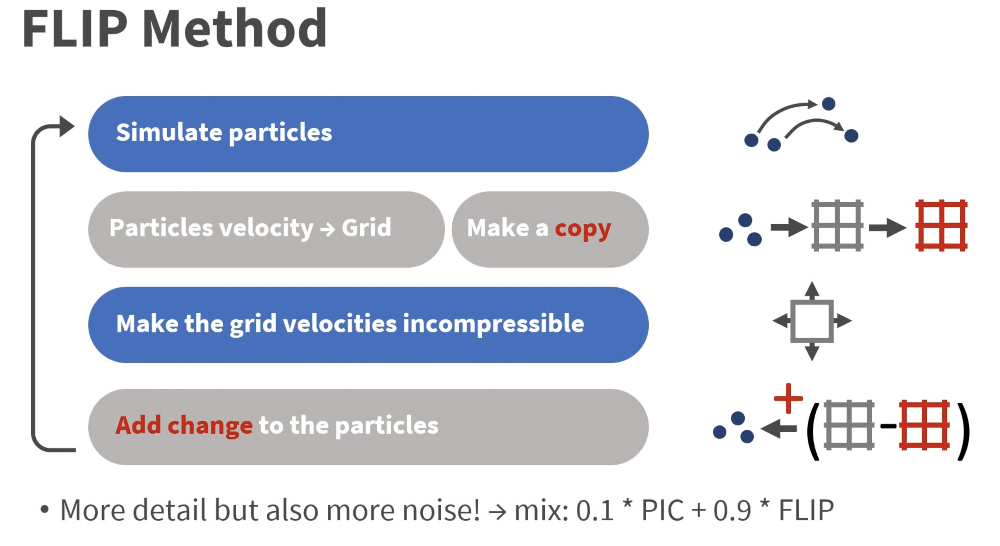
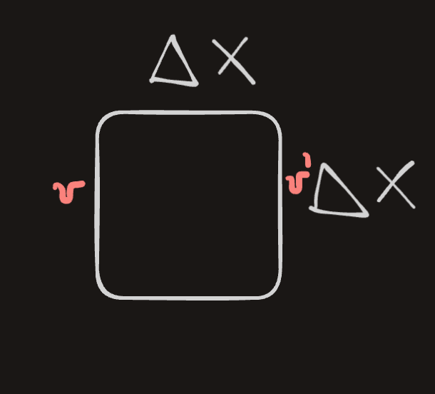

# FLIP - Animating Sand As a Fluid


We can simulate sand using a fluid simulator by accounting for *inter-grain interactions* (friction / boundary friction).

We will use *particles for advection* and the *grid for spatial interactions* (incompressibility, friction forces, boundary conditions).

**Background**: Previous methods for fluid simulation, particularly [[PIC]] had a problem with *numerical dissipation* .  This was later fixed by [[FLIP - Animating sand as fluid]]. Some time after it was extended to a elasto-plastic finite element formulation, which became [[MPM and Hybrid Euler - Lagrange simulations]].

> To better understand why PIC leads to dissipation, note that since grid has a smaller number of DOF for velocity than particles, the $v$ at particles gets smoothed out! This looses information. In FLIP, we *save* the old velocities and add to them the differential from the new velocity.

I like the following visualization of the FLIP method:



With this out of the way, lets dive into how this paper simulates sand using fluid simulators!
## Modelling Sand

When simulating sand, an important thing to consider is frictional plasticity.

> **Frictional plasticity** describes the behavior of materials, especially soils and rocks, under stress, where *permanent deformation* occurs due to friction between grains or surfaces, rather than purely elastic behavior. 


We define the mean stress term $\sigma_\mu = tr(\sigma)/3$ and a Von-Mises [[shear]] [[stress]] $\tilde\sigma = |\sigma-\sigma_{\mu}\delta |_F / \sqrt{2}$.

Mohr-Coulumb law tells us that a material will not yield as long as the following condition holds:

$$\sqrt{3} \tilde\sigma < \sin(\phi)\sigma_\mu$$

where $\phi$ is the friction angle. 

> Intuitively, the LHS is the *"shear force trying to make the sand to slide."* The $\sqrt{3}$​ comes from the geometry of 3D stress (it ensures the condition works in all directions). The RHS is the *"resistance to failure."* It depends on the $\sigma_\mu$ which represents the "pressure" acting equally in all directions, making it harder for sand to move, and $\sin(\phi))$ accounts for higher friction angle making it harder for grains to slide.


If this condition is **broken**, then material flow starts. The direction of the flow is $(\tilde\sigma -\sigma_\mu \delta)$ (not equal to the gradient of yield condition!)

Note: sand does dialate as it flows, but we will ignore that. We also want to avoid FEM implicit solving so we will make some further simplications.

### Simplification
We will ignore elastic deformations and volume changes during flow. This allows us to *decompose regions* of sand into those that move rigidly and those that move based on incompressible shearing flow.

Assume that that the pressure required to make the entire velocity field incompressible will be similar to the true pressure in the sand (which is actually false, but works well in our case).

So since we are ignoring elastic deformations we can describe *frictional stress* in the regions where the sand is flowing with:

$$\sigma_f = - \sin(\phi)p \frac{D}{\sqrt{1/3} |D|_F}$$

where $D$ is the strain rate and is expressed in terms of the velocity $u$ as $D = (\nabla u + \nabla u^\top)/2$. $\sigma_f$ can be thought of as the point on the *yield surface* that *most directly resists sliding*.


Given the frictional stress in the regions that flow, we need to find a way to determine the *yield conditions without tracking stress / strain.* So consider a 1-grid cell with side-length $\Delta x$. The relative sliding velocity b/w opposing faces is:



$$V_r = \Delta x D$$
and the mass is:

$$M = \rho \Delta x^3.$$

Ignore other cells. the $f$ required to stop ALL sliding motion within 1-timestep is:

$$ f = - V_r M / \Delta t = -\frac{(\Delta x D) (\rho \Delta x^3)}{\Delta t}$$

which gives the new velocity as $v^{new} = v + \Delta t (F/M)$.  Recall that stress is defined as force per cross-sectional area:

$$\sigma_{rigid} = -\frac{\rho D \Delta x^2}{\Delta t}$$
If $\sigma_{rigid}$ satisfies the yield condition (that is it can resist the shearing), then the material in that cell will be rigid, else it will be flowing . With this we can consider the FLIP algorithm applied to this simulation.

### FLIP Algorithm:

```python
Each step:
	Advect fluid
	Fluid solver steps (gravity, boundary, pressure for incrompressiblity)
	for each cell
		Evaluate *strain rate tensor D* 
	if \sigma_rigid satisfies *yield condition*
		rigid cell
	else
		\sigma_f used for direction of flow
	find all connected groups of rigid cells, and project the velocity field
	in each separate group to the space of rigid body motions (i.e. find translational and rotational velocity which preserve the total linear and angular momentum of the group). 
	
	The remaining velocity values we update with the frictional stress, using standard central differences 
	
```


The last velocity update step is performed as:

$$u^+ = u^- + \Delta t / \rho \nabla \cdot \sigma_f.$$


### Frictional Boundary Conditions
So far we have only considered friction within the sand, we now consider friction with the boundaries. 

**Idea:** friction formulation enforces $u \cdot n \geq 0$ condition on the grid.

$$u_T = \max \left(0, 1- \frac{\mu|u \cdot n|)}{|\mu_T|}\right)u_T$$

which is the tangential component of velocity. It is 0 for static friction, in which case the sand will stick even to vertical surfaces. $\mu$ is the Coulomb friction coefficient. 


### (optional) Enhancement of the model
We enhance our MC condition using *cohesion:*

$$\sqrt{\tilde \sigma} < \sin (\phi) \sigma_{\mu} + c$$

where $c$ is the cohesion term. This allows us to model slightly sticky solids and allows the material to support some tension before yielding.


### FLUID simulation
Problem with PIC is that numerical dissipation arises from repeated averaging and  interpolation. FLIP fixes this with the following insight:

> Particles are the main representation of the fluid and we only use the grid to *increment particle variables* according to change $\Delta$ computed on the grid


### FLIP for incompressible fluids!

Here is how we can adapt FLIP to incompressible fluid simulation:


``` python
1. Init {p} with v and x
2. For each t
	1. at each (MAC) grid point (i,j)
		1. weighted avg of nerby v of {p}
	2. (FLIP) save grid velocities v_old
	3. non-advection updates on the grid
	4. (FLIP) $\Delta$ = u_new - u_old. Add to {p}
	5. (PIC) interpolate u_new for {p}
	6. Move particles using new velocity (and account for boundary conditions)
```


For the 2.3. ) step, we first add the $\ddot{x}$ due to $g$ to the grid velocities. Then construct a distance field $\phi(x)$ in the non-fluid part of the grid using fast sweeping and use that to extend the velocity field outside the fluid with the PDE $\nabla u \cdot \nabla \phi= 0$. 

They enforce boundary conditions and incompressibility as in Enright et al.[2002b].

For 2.6 at each particle, they trilinearly interpolate either the velocity (PIC) or the change in velocity (FLIP) recorded at the surrounding eight grid points.


### Reconstructing the surface

All this time we have been talking about how to simulate *particles*. But if we want to simulate a continuum, we need to reconstruct the surface from those particles. 

We could use [[Marching cubes]], but that will result in "blobby" appearance. Instead, we use a different approach:

> we exactly reconstruct the signed distance field of an isolated particle.

For $p$ at $x_0$ with radius $r$ we have the SDF:

$$ \phi(x) = |x - x_0 | + r$$
We can generalize this by replacing $x_0$ with $\sum_i  w_ix_i$  where $\sum_i w_i  = 1$, and similarly for $r$. This gives:

$$\phi(x) = |x - \bar x| + \bar r.$$
We define $w_i$ using a kernel function that smoothly drops to 0 (see the paper for more details).

