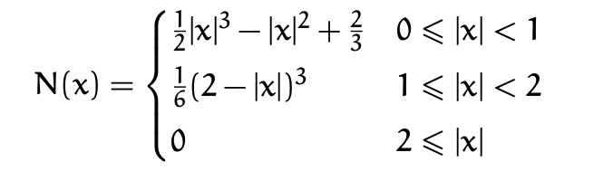
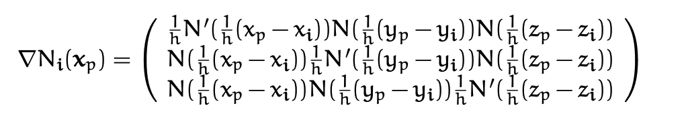
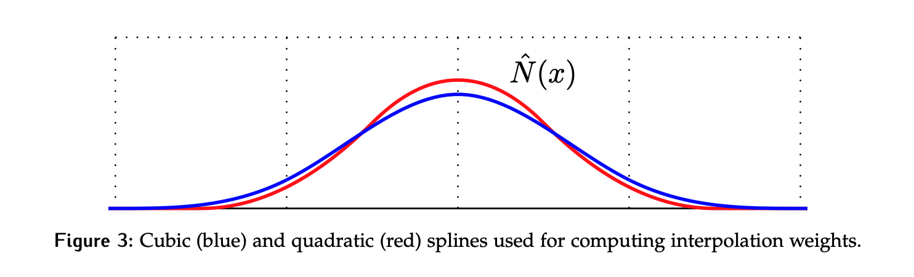

# Material Point Method: Graphics Perspective

In various applications we need a lot of control over our simulation, all while wanting performant simulations with topology changes and numerical stability. This lead to development of hybrid Lagrange - Euler methods, which instead  of just simulating with particles (Lagrange formulation) or just on a grid (Eulerian formulation), uses strengths of each of the formulations.

Here we will discuss **MPM (Material Point Method)**, which is a generalization of Particle in Cell (PIC) and Fluid Implicit Particle Method (FLIP) to the setting of *solid mechanics*.

The benefits of the hybrid approach are:
1. can be derived from weak form of conservation of momentum (Lagrangian)
2. boundary conditions (wall collisions, external forces) can be easily applied on the grid and particles
3. Automatic self collision/contact due to the fact that particle movements are interpolated from undistortable nodal movement on a grid.
4. Automatic *multi-material* and *multiphase coupling* can be easily done solely by giving particles different material properties or constitutive models.
5. MPM can also be used to simulate mesh-based Lagrangian forces without loosing its advantages.

> MPM is a **Lagrangian method, but with an Eulerian grid used for computing derivatives.** This alleviates the need for a Lagrangian mesh (for derivative computation) that would get tangled when the material is highly deformed from its original configuration.

The Eulerian view allows for treating topological changes and collisions easily.

## Kinematics Theory: Revision

Contrary to what the name might imply, the MPM "particles" are not really individual particles as one might think in case of a particle system. These *particles* are actually small parts of continuous piece of material ($\subset \Omega$ where $\Omega$ is the who simulated material domain). 

> **Material points** can be thought of as quadrature points for the discretization of spatial stress derivatives (discuss later).

Recall, that when in the setting of continuum mechanics we make an assumption, **continuum assumption**, meaning all materials we consider are treated as *continuous peaces of matter.* 

Material space defined as $X$ and world space as $x$, then deformation map is:
$$\phi(\cdot, t): \Omega^0 \rightarrow \Omega^t$$
where $\Omega^0, \Omega^t \subset \mathrm{R}^d$, and points on $X$ are in $\Omega^0$.  Then we can describe motion of each *material point* $X\in \Omega^0$ as:

$$ x = x (X,t) = \phi(X,t).$$

With this mapping we can quantify relevant continuum based physics. The velocity of a given material point $X$ at time $t$ is:

$$V(X,t) = \partial_t \phi(X,t)$$
and acceleration is:
$$A(X,t) = \partial_t^2 \phi(X,t) = \partial_t V (X,t) $$
where both $A,V$ are maps from $\Omega^0$ to $R^d$. It is good to start thinking about the different views possible. $A,V$ are defined above in the "Lagrange view", i.e. they are functions of material configurations $X$ and time $t$. What this really means is that we are *measuring them at fixed positions in space*. We will usually start deriving quantities from the Lagrangian view.

Next, we want to describe the deformations of $\Omega^0$ caused by $\Phi$ . We define the Jacobian of the deformation map as:

$$F(X,t) = \partial_X \phi (X,t) = \partial_X x (X,t)$$
where $F$ is sometimes called the **deformation gradient** and its a mapping $\Omega^0 \rightarrow \mathrm{R}^{d\times d}$, that is, for each material point $X$ it tells us the deformation Jacobian at some time $t$:

$$F_{ij} = \partial_{X_j}\phi_i = \partial_{X_j}x_i.$$
This describes how the material is deformed *locally*. Often we use $J = det(F)$ to determine the infitesimal changes in volume due to the deformation. 

**Push Forward & Pull Back.**

We have so far assumed that $\phi$ is bijective and since its smooth, we know that $\Omega^0, \Omega^t$ are [[homeomorphic]]/[[diffeomorphic]] under $\phi$. This is relevant to the assumption that no 2 particles ever occupy the same part of $\Omega$ at the same time.

You can think of a homeomorphism as a way to stretch, bend, or twist one space into another without tearing or gluing any points together. For example, a coffee cup and a doughnut are homeomorphic because you can deform one into the other continuously.

This means that we have inverse deformation mapping $\phi^{-1}(\cdot, t): \Omega^t \rightarrow \Omega^0$. This means that any function over $X$ can be thought of naturally as a function over $x$, by simple change of variables.

We call these changes in variables:
- push forward - taking a function over $\Omega^0$ and defining its counterpart on $\Omega^t$
- pull back - taking a function over $\Omega^t$ and defining its counterpart on $\Omega^0$.

==Example:== given $G: \Omega^0 \rightarrow \mathrm{R}$, then $g(x, t) = G(\phi^{-1}(x,t))$. 

The **push forward** function is sometimes called Eulerian (i.e. in terms of $x$) and the **pull back** is called Lagrangian (in terms of $X$). Recalling from before:

$$V(X,t) = \partial_t \phi (X,t),\quad A(X,t) = \partial_t V(X,t)$$
we can write the Eulerian versions:

$$v(x,t) = V(\phi^{-1}(x,t),t )\quad a(x,t) = A(\phi^{-1} (x,t),t),$$
and equivalently:

$$V(X,t) = v(\phi(X,t),t), \quad A(X,t) = a(\phi(X,t), t).$$

Using chain rule:

$$A(X,t) = \partial_t v(\phi(X,t),t) + \partial_x v(\phi(X,t),t)\partial_t\phi(X,t)).$$

Further we can write the $v_i$ as:

$$v_i(x,t) = \partial_t \phi_j (\phi^{-1}(x,t),t) =\partial_t \phi_j (X,t) ,$$
$$a_i(x,t) = A_i(\phi^{-1}(x,t),t) = \partial_{t} v_i(x,t) + \partial_{x_j} v_i(x,t) v_j(x,t)$$

where we used $x=\phi(\phi^{-1}(x,t),t)$. This actually gives a quite non-intuitive result...

$$a_i(x,t) \neq \partial_{t}v_i (x,t),$$
but why? We will see that in Eulerian view the relationship between $a,v$ is not anymore differential in the time domain, but it is something called *material derivative.*

**Material Derivative: relating $a,v$ in Eulerian view.**

> [!Note] 
> The material derivative is defined for any [tensor field](https://en.wikipedia.org/wiki/Tensor_field "Tensor field") $y$ that is _macroscopic_, with the sense that it depends only on position and time coordinates, $y = y(x,t)$:
> 
>  $$\frac{Dy}{Dt} = \frac{\partial y}{\partial t} + u \cdot \nabla^x y$$
>  where $\nabla y$ is the [covariant derivative](https://en.wikipedia.org/wiki/Covariant_derivative "Covariant derivative") of the tensor, and $u(x,t)$ is the [flow velocity](https://en.wikipedia.org/wiki/Flow_velocity "Flow velocity").
>  
>  The material derivative *operator* can be written as:
>  
>  $$\frac{D}{Dt} = \frac{\partial}{\partial t} + u \cdot \nabla^x$$

In our setting , the macroscopic tensor field is $v(x,t)$ so we get:

$$\frac{D}{Dt} v_i(x,t) = \partial_t v_i (x,t) + \partial_{x_j} v_i (x,t)v_j (x,t)$$
can be written by saying $a = \frac{D}{Dt}v$. So for a general **Eulerian function** $f(\cdot, t): \Omega^t \rightarrow \mathrm{R}$ we can use the same material derivative notation to say:

$$\frac{D}{Dt}f(x,t) = \partial_t f(x,t) + \partial_{x_j} f(x,t)v_j(x,t)$$

where $\frac{D}{Dt}f(x,t)$is actually the push-forward of $\partial_t F$ where $F$ is the *Lagrangian* deformation gradient function (equivalently $F$ is pull-back of $f$). 

If $f(\cdot, t)$ is the push-forward of $F$, then:

$$\frac{D}{Dt} f = \partial_x vf \quad || \quad \frac{D}{Dt}f_{ij} = \partial_{x_k}v_i f_{kj}$$
with implied summation over the index $k$ (Einsten notation). We can also write it in terms of $F$:

$$\dot{F} = (\nabla v)F \quad || \quad \frac{D}{Dt}F = (\nabla v)F.$$
You can see this through:
$$\partial_t F_{ij}(X,t) = \partial_t \partial_{X_j}\phi_i(X,t) = \partial_{X_j}V_i(X,t) = \partial_{x_k}v_i(\phi(X,t),t) \partial_{X_j}\phi_k (X,t).$$To see this note that:

$$\partial_t \phi_i = \partial_{X_k} \phi_i \partial_t X_k = \partial_{X_k}\phi_i v_k$$
$$\partial_t = \partial_{X_k} v_k.$$

Next, we will talk about changes in volume of deformed objects.

**Volume & Area change.** First, we will relate a small deformation $dV$ in material space to $dv$ in the world space. We have $dV = dL_1 e_1 \cdot (dL_2 e_2 \times dL_3 e_3)$, where $dL_i$ are tiny values, so $d\boldsymbol{L_i} = dL_i e_i$ , giving us $dV = dL_i dL_2 dL_3$. So the deformed vectors in world space are related using the deformation gradient $F$:

$$dl_i = Fd\boldsymbol L_i.$$
We can show that $dl_1dl_2dl_3 = JdL_1 dL_2 dL_3$. This gives us the desired relation:

$$dv = JdV$$
where $J=det(F)$. Given this, one might realize that we can now relate integrals over $g(x),G(X)$:

$$\int_{B^t}g(x)dx = \int_{B^0}G(X)J(X,t)dX$$
where $B^t \subset \Omega^t$ and $B^0$ is the pre-image of $B^t$ under $\phi(\cdot, t)$, and $G$ is pullback of $g$. We can do similar analysis for area and get relationship between surface integrals:

$$\int_{\partial{B^t}} h(x,t)\cdot n(x)ds(x) = \int_ {\partial_{\partial B^{0}}} H(X)\cdot F^{-T}(X,t)N(X)J(X,t)dS(X)$$

where $H: \Omega^0\rightarrow R^d$ is the pull back of $h:\Omega^t \rightarrow R^d$ and $n(x)$ is the unit outward normal of $\partial B^t$ at $x$, similarly for $N(X)$. This relationships will later be very useful for deriving equations of motion.

## Hyperelasticity
In this section I just want to briefly introduce how **stress** is related to the deformation gradient (or generally, the strain). 

Stress is again a filed that exists on the whole domain $\Omega$. We will use the Cauchy stress definition, that is $\sigma(\cdot, t): \Omega^t \rightarrow \mathbb{R}^{d\times d}$.  To describe motion we need a model that maps state ($F$) to the stress $\sigma$.  If we are talking about *perfectly hyperelastic* materials, then we can define it through *potential energy, which increases with non-rigid deformations* away from $\Omega^0$.

For solids, we express strain in terms of $F$ and $1^{st}$ Piola-Kirschoff stress, since they are more easily expressed in *material space * $X$.

**Def.** Hyperelastic materials are elastic solids whose 1PK  $P$ can be derived from **strain energy density** function:

$$P = \partial_F \Psi$$
where $\Psi(F)$ is the elastic energy density function, which penalizes non-rigid $F$ deformations. In the engineering literature you will see:

$$\sigma = J^{-1} PF^\top = \frac{1}{det(F)}\partial_F \Psi F^\top.$$
> Material is defined by the interaction between $\Phi$ and $\sigma$.

We want to penalize motion that is non-rigid, i.e. not $\phi(X,t) = R(t)X + t(t)$. So we can define the energy function:

$$\Psi(F) = \tilde{\Psi}(F^\top F)$$
so that we express that if $F$ is orthogonal, then the energy does not change. We call $F^\top F = C$. If the material is [[isotropic]], then we can further write:
$$\Psi = \tilde{\Psi} (I_1,I_2,I_3)$$

where $I_i$ are coefficients of the characteristic polynomial of $F^\top F$ and are called *isotropic invariants*:

$$I_1 = tr(C)\quad I_2 = tr(CC)\quad I_3 = det(C) = J^2.$$
Since we are a graphics community we further write this using $F=U \Sigma V^\top$ using "Polar SVD" to get:

$$\Psi(F) = \hat{\Psi}(\Sigma(F)).$$
This means that we can simply compute the energy density function in terms of singular values of the deformation gradient if the material is isotropic. Note, this is simple, but can be tricky when trying to differentiate singular values as a function of $F$.

We will now cover few popular deformation models.

**Neo-Hookean.** The energy density function is:

$$\Psi_{NH}(F) = \mu /2 \left(tr(F^\top F) - d\right) - \mu log(J)+ \lambda/2 \log^2(J)$$
where $d\in \{2,3\}$ depending on the problem dimension and $\mu, \lambda$ are Young's modulus and Poisson's ratio. So when $F$ is a rotation, then $\Psi = 0$. If $J > 0$, then $\Psi(F) \geq 0$. We define:

$$P = \mu (F-F^\top) + \lambda \log(J)F^{-T}$$

And then $\partial_F P$ can be related to the force. 

**Corotated Constitutive Model.** 

$$P(F) = \partial_F \Psi(F) = 2\mu (F-R) + \lambda (J-1) F^{-T}$$
For how to compute the second derivative refer to the notes.

**Snow Elasticity model.**
Look at mpm-snow notes!

### Efficiently Differentiating Isotropic Elasticity
Soon to come...

## Governing Equations

In our simulation the equations of interest are **conservation of mass and momentum**. Later we will derive the weak form of the force balance, since it is essential in deriving the end temporal and spatial discretization of our equations. 

First, let $V(X,t) = \partial_t \Phi(X,t) = \partial_t x(X,t)$ be the velocity on $X$, as above. In the Lagrangian view, the conservation equations are:

1. $R(X,t)J(X,t)= R(X,0)$ **Conservation of Mass**
2. $R(X,0)\partial_t V = \nabla^X \cdot P + R(X,0) g$ **Conservation of momentum**

where $X$ is over $\Omega^0$ and $t>0$. $R$ is a new quantity and it is called the **Lagrangian Mass Density** which is related to **Eulerian Mass Density** you should be familiar with, i.e. $\rho$. 

$$R(X,t) = \rho (\phi(X,t),t)$$

> [!Note] We can also write the mass conservation as 
> $$\partial_t (R(X,t)J(X,t)) = 0$$

Now in the Eulerian view, the equations become:

$$\frac{D}{Dt}\rho (x,t) + \rho(x,t)\nabla^x \cdot v(x,t)= 0$$
and
$$\rho(x,t)\frac{D}{Dt}v(x,t) = \nabla^x \cdot \sigma + \rho(x,t)g$$

where $\frac{D}{Dt} = \frac{\partial}{\partial t} + v \cdot \nabla^x$ .  Comparing the two views, one thing you can notice is that in the Lagrangian view we use the Piola-Kirchoff stress $P$ and in the Eulerian view we use the Cauchy stress $\sigma$.

**Derivations.**

Given $\rho(x,t), R(X,t)$ (latter being the pull back), we have:

$$R(X,t) = \rho (\phi(X,t),t)$$
$$\rho(x,t)= R(\phi^{-1}(x,t),t)$$

and we can think of $\rho$ as a value over $\Omega^t$ in the form:

$$\rho(x,t) = \lim_{\epsilon \rightarrow +0}\frac{m(B_{\epsilon}^t)}{\int_{B^t_\epsilon (x)} dx}$$

where $B_{\epsilon}^t$ is the ball of radius $\epsilon$ centered at $x$ $x\in \Omega^t$. Plugging in $0,t$ for $t$ we get the conservation:

$$m(B_{\epsilon}^t(x)) = \int_{B_{\epsilon}^t(x)}\rho(x,t)dx = \int_{B_{\epsilon}^0}R(X,t)J dX = \int_{B_\epsilon^0} R(X,0)dX = m(B_{\epsilon}^0(x))$$

$\forall B_{\epsilon^t}\in \Omega^t$, where $B_{\epsilon}^0$ is the *pre-image* of $B_{\epsilon}^t$ under the mapping $\phi(\cdot, t)$. If you are confused by these steps, review the pull back / push forward change of variables discussed above. So the mass in any $B^t$ should not change with $t$. Since $B$ is arbitrary we conclude:

$$R(X,t)J(X,t) = R(X,0), \forall X\in \Omega^0, t\geq 0.$$

where $J(X,0) = 1$. Similarly we can write:

> [!Note] Lagrangian conservation law of mass:
> 
$$\partial_t (R(X,t)J(X,t)) = 0$$
following from above.

With the Lagrangian view set, we want to get the Eulerian view formulation. First note that:

$$\partial_t (RJ) = \partial_t R \cdot J + R \cdot \partial_t J$$

and by the chain rule we can expand further:

$$\partial_t J = \partial_{F_{ij}} J \partial_t F_{ij} = JF^{-1}_{ji}\partial_{X_j}V_i = JF_{ji}^{-1}\partial_{x_k}v_i F_{kj}$$
$$ = J \delta_{ik}\partial_{x_k}v_i = J \partial_{x_i}v_i = J \nabla v$$Above we have used the determinant differentiation rule $\partial_F J= JF^{-T}$. Plugging that back we get the conservation law:

$$\partial_{t}R \cdot J + R J\cdot \partial_{x_i}v_i = 0.$$

If we perform push-foward on both sides we get the Eulerian view of the mass conservation. First note that it can be shown that $\partial_t J = J \nabla \cdot v$. Consider the 1st term:

$$\partial_t R = \partial_t (\rho(\phi(X,t),t)) = \partial_t \rho(x(t),t) + \sum_{j=1}^n \partial_{t}x_j \partial_{x_j}\rho(x(t),t) $$
where the 1st term is the explicit time dependence (local rate) and 2nd term is the implict time dependence through $x(t)$ (convective rate). This can be rewritten as:

$$\partial_t R = \partial_t \rho + v \cdot \nabla \rho$$
which is exactly $\frac{D\rho}{Dt}$ ! Next we can rewrite the conservation law as:

$$\partial_t R J + R J \cdot  \nabla v = 0$$
so we can divide by $J$ and plug in our above expression as well as $R(X,t) = \rho(x,t)$ to get:

> [!Note] Euler mass conservation equation:
$$\frac{D}{Dt}\rho(x,t) + \rho(x,t)\nabla \cdot v(x,t) = 0, \forall x \in \Omega^t, t\geq 0$$

Intuitively, the equation states that the rate at which mass enters a small volume element must equal the rate at which mass leaves that volume element plus the rate at which mass is created or destroyed within that volume element (2nd term).

To get conservation of momentum we can do something similar.

> Continuum forces are classified as either body forces (e.g. gravity) or surface forces (stress-based). The latter depend on existance of a **traction field (force per area).** 

Traction field is defined as:

$$f(B_{\epsilon}^t) = \int_{\partial B_\epsilon^t}t(x,n(x))ds(x)$$

which is the *net-force on an arbitrary* $B_\epsilon^t$ exerted from material outside $\partial B_\epsilon^t$ on the material inside. That is, its the net force that material at $n^+$ side exerts on the material at $n^-$ side at point $x$. Then the Cauchy stress is:

$$t(x,n,t) = \sigma(x,t) \cdot n(x)$$
where $n(x)$ is the outward normal to the surface $\partial B_\epsilon^t$ at point $x$. With this **conservation of momentum** can be written as:

$$\partial_t \int_{B_{\epsilon}^t}\rho (x,t)v(x,t)dx = \partial_t \int_{B_{\epsilon}^0} R(X,t) V(X,t) J dX = \int_{B_{\epsilon}^0} R(X,0)A(X,t) dX$$
$$= \int_{\partial B_{\epsilon^t}}\sigma n ds(x) + \int_{B_{\epsilon^t}} f^{ext}dx$$

$\forall B_{\epsilon}^t \subset \Omega^t$, where $f^{ext}$ is the external force per unit volume. The first term is the *net force* on the material in $B_{\epsilon}^t$ due to the Cauchy stress field $\sigma$ acting on the surface $\partial B_{\epsilon}^t$. The second term is the net external force acting on the material in $B_{\epsilon}^t$.

Therefore the rate of change of the momentum in $B_\epsilon^t$ is equal to the net force on $B_{\epsilon}^t$ expressed via the Cauchy stress field plus the external force. 

If we push forward the the LHS we get:

$$\int_{B_{\epsilon}^t}\rho(x,t) a(x,t) dx   = \int_{\partial B_{\epsilon^t}}\sigma n ds(x) + \int_{B_{\epsilon^t}} f^{ext}dx = \int_{B_{\epsilon}^t} \nabla^x \cdot \sigma dx + \int_{B_\epsilon^t}f^{ext}dx$$

or equivalently:

$$\rho a = \nabla^x \cdot \sigma + f^{ext}, \forall x \in \Omega^t, t\geq 0.$$

where we have used the divergence theorem to convert the surface integral into a volume integral. Equivalently if we start at the RHS and pullback we get the Lagrangian form:

$$R(X,0) A(X,t) = \nabla^x P(X,t) + F^{ext} (X,t) J(X,t); \forall X\in \Omega^0, t\geq 0$$

where $F^{ext}$ is the pullback of $f^{ext}$.

**Weak Form of Force Balance.**  

For a quick summary on what the "weak form" here means, look here [[Weak and Strong formulation]]. 

We can think of MPM like an FEM **discretization of the (stress based) forces over the Eulerian grid.** As such we can use the weak form of force balance. The weak form is a mathematical formulation that allows for the analysis of systems where the governing equations may be difficult to solve directly due to complex geometries, boundary conditions, or nonlinear behavior.

> The weak form transforms differential equations into integral equations. This transformation is particularly useful for numerical methods because integral equations are generally easier to approximate and solve computationally.

We can think of the weak form as Lagrangian and for now we will ignore external forces on the system. From conservation of momentum we have:

$$R(X,0)A(X,t) = \nabla^x \cdot P(X,t); \forall X,t$$
which we can decompose into separate relationships: $R_0A_i = P_{ij,j}$. To get the weak form we can take *any function* $Q(\cdot, t): \Omega^0 \rightarrow \mathbb{R}^d$ and take the integral of its dot product with the above equation:

$$\int_{\Omega^0} Q_i(X,t)R_0A_i dX = \int_{\Omega^0}Q_i(X,t)P_{ij,j}(X,t)dX$$

$$ = \int_{\Omega^0}((Q_i(X,t)P_{ij}(X,t))_{,j} - Q_{i,j}(X,t)P_{ij}(X,t))dX$$

$$=\int_{\partial \Omega^0} Q_i(X,t)P_{ij}(X,t)N_j(X,t)ds(X) - \int_{\Omega^0}Q_{i,j}(X,t) P_{ij}(X,t) dX. $$

Here $P_{ij}N_j$ would be called a "boundary condition". If we let $T(X,t)$ be the **boundary force** per unit reference area and $T_i =P_{ij}N_j$, then the weak form of force balance implies:

> [!Note] Weak force balance in Lagrangian view
> 
> $$\forall Q(\cdot,t):\Omega^{0}\rightarrow \mathbb{R}^d; \quad \int_{\Omega^0}Q_i(X,t)R(X,0)A_i(X,t)dX = \int_{\partial\Omega^0}Q_iT_ids(X) - \int_{\Omega^0}Q_{i,j}P_{ij}dX$$

In the setting of **MPM, the stress derivatives will be discretized in the current configuration**, so we can use push forward on stress involving integrals to get the Eulerian view!

Let $q$ be the push-forward of $Q$ , i.e. $Q(X,t) = q(\phi(X,t),t)$ and the inverse. Then we can write:

$$Q_{i,j} = \partial_{X_j}Q_i = \partial_{x_k}q_i \partial_{X_j}x_k = q_{i,k}F_{kj}$$

by definition of $F$. Recall $\sigma_{ik} = J^{-1}P_{ij}F_{kj}$ and say $t$ is the external force per unit area in the Eulerian view (i.e. $t$ is push-forward of $T$). Then:

> [!Note] The weak form in the Eulerian view
> 
> $$\forall q(\cdot, t): \Omega^t \rightarrow \mathbb{R}^d; \int_{\Omega^t}q_i(x,t)\rho(x,t)a_i(x,t)dx = \int_{\partial\Omega^t}q_it_i ds(x) - \int_{\Omega^t}q_{i,k}\sigma_{i,k}dx$$

This also implies:

$$\int_{\Omega^0} Q_i R_0 A_i dX = \int_{\partial\Omega^t}q_it_i ds(x) - \int_{\Omega^t}q_{i,k}\sigma_{i,k}dx $$

**We will use this formula to perform MPM discretization on the grid.** More on this later. Now, lets shift gears and look at what material particles are!

## Material Points / Particles
In MPM, material points represented the simulated materials. They are Lagrangian, because we track the properties of the individual particles through time. The state of a system is represented as masses, velocities, and positions:

$$m_p \in \{m_1,\dots,m_n\}, v_p \in \{v_1,\dots,v_n\}, x_p \in \{x_1,\dots,x_n\}$$

> The important point here is that **all the stress based forces are computed on the Eulerian grid.**  This necessitates transfer of material state from Lagrangian to Eulerian configuration, so we can incorporate effects of material forces. Afterwards, we have to do the reverse; we transfer the force effects back to the material points and move them in the "Lagrangian way".

Just like any other PIC/FLIP solvers, MPM solves the governing equation on a back ground Eulerian grid. The grid acts as a scratch pad. It can be destroyed after each solve and reinitialized in the beginning of the next time step. In practice, it is easy to just use a fixed Cartesian grid.

**Eulerian Interpolating Functions.**  In each time step of MPM, particles transfer their mass and momentum to the grid nodes. After the grid solve, velocities are transferred back to particles for them to perform the advection step. 

You might already realize, that both of these transfers require *interpolation functions.* Using a *Finite Element* perspective, we can think of the Eulerian grid as a "mesh" and particles as the [[quadrature points]]. 

- grid ~ mesh
- particles ~ quadrature points

So instead of thinking of the interpolation function as a kind of a "kernel" over particles (which is a common view in SPH), we can instead think of them as *defined over grid nodes.*

We can denote the interpolation function at grid node $i$ with $N_i(x)$ (keep in mind that in this context $i$ should be thought as a multi-index for grid nodes, e.g. $i=(i,j,k)$ in 3D). 

When the function is evaluated at a particle location $x_p$, then we can write $N_i(x_p) = w_{ip}$. You can think of associating with each particle and each grid node some weight $w_{ip}$. This weight determines how much the particle and node interact.

Intuitively, if the particle and grid node are close, then weights should be large. To achieve this we can model the *grid-basis functions* as **one-dimensional interpolant functions:**

$$N_i(x_p) = N(\frac{1}{h}(x_p - x_i))N(\frac{1}{h}(y_p - y_i))N(\frac{1}{h}(z_p - z_i))$$

where $x_p = (x_p,y_p,z_p)$ is the point at which we are evaluating it, and $h$ is the grid spacing, and $x_i$ is the grid node position.

More compactly we could write $w_{ip}= N_i(x_p)$ and $\nabla w_{ip} = \nabla N_i(x_p)$. 

*Note: Now, we cannot use multi-linear kernel from CLIP here, because 1.) $\nabla w_{ip}$ would be discontinuous and give dis-continuous forces, and 2.) $\nabla w_{ip}$ may be far from zero when $w_{ip}\approx 0$, giving large forces applied to grid nodes with tiny weights.* 

For MPM we would ideally have $C^1$ for interpolation function so we prevent **"cell-crossing instability".**  We usually use Cubic or Quadratic B splines.

Recall from preschool that the cubic kernel is:

where $h$ is the grid spacing. And its derivative can be computed as:

Here are the cubic and quadratic interpolant splines visaulized:

**Eulerian / Lagrangian Mass.** When representing our material as a finite collection of points, we can assign each point a subset of the total material, i.e. a $B_{\delta x, p}^0 \subset \Omega^0$. Then the mass of a particle is just the integral over that domain of the density:

$$m_p^n = \int_{B^{t^n}_{\delta x ,p}} \rho(x,t^n)dx$$

which lends itself nicely to **transferring mass and momentum to nodes of the Eulerian grid.** Define the mass of the Eulerian grid at node $i$ as:

$$m_i = \sum_{p} m_p N_i(x_p)$$
and so summing over all nodal points:

$$\sum_{i}m_i = \sum_{i}\sum_{p}m_p N_i(x_p) = \sum_{p}m_p \sum_{i}N_i(x_p) = \sum_p m_p$$

which says that *sum of mass over all nodal points is the same as the mass over all material points!* This is exactly what we want.

**Eulerian / Lagrangian Momentum.** Now we want to transfer momentum, for now we will do this as:

$$(mv)_i = \sum_{p}m_p v_p N_i(x_p)$$
$$\sum_{i}(mv)_i = \sum_{p}m_pv_p$$

by similar logic as above. The Eulerian velocity is then:

$$v_i = \frac{(mv)_i}{m_i}$$
and to transfer from Eulerian to Lagrangian, specifically to transfer velocity, we simply interpolate:

$$v_p = \sum_{i}v_i N_i(x_p)$$
which conserves momentum. Later we will present [[APIC - The Affine Particle-In-Cell Method]] and use its transfer for momentum.

## Discretization

In this section we will first talk about how to discretize our model in time, then how to discretize it in space, and final we will talk about computing volumes and deformation gradients and forces.

**Time discretization.** Assume we are at time $t^n$. The weak form of the force balance implies:

$$\int_{\Omega^0}Q_i R_0 A_i dX = \int_{\partial \Omega^{t^n}}q_i t_i ds(x) - \int_{\Omega^{t^n}}q_{i,k} \sigma_{i,k}dx$$

which should hold $\forall q(x,t^n)$ (or $Q(X,t^n)$). Replace Lagrangian acceleration with  a discretization:
$$A_i \approx \frac{1}{\Delta t}(V_{i}^{n+1}-V_i^n).$$We can push $\Omega^0$ to $\Omega^t$ so we get:

$$\frac{1}{\Delta t}\int_{\Omega^{t^n}}q_i(x,t^n)\rho(x,t^n) (v_i^{n+1}(x)-v_i^n(x))dx$$
$$ = \int_{\partial \Omega^{t^n}} q_i(x,t^n)t_i(x,t^n)ds(x) - \int_{\Omega^{t^n}}q_{i,k}(x,t^n)\sigma_{ik}(x,t^n)dx$$

In this notation both $v^n, v^{n+1}$ are defined over $x \in \Omega^{t^n}$ . From pull backwards we get $v_{i}^{n+1}(x) = V_i(\phi^{-1} (x,t^n), t^{n+1})$ and similar for $v_i^t(x)$.

Note that $i,k$ here are component indices for dimensions, but we also want to use that for grid nodes. So let us just denote component indices with $\alpha, \beta, \gamma$, so we have to rewrite the above as:

$$\frac{1}{\Delta t}\int_{\Omega^{t^n}}q_\alpha(x,t^n)\rho(x,t^n) (v_\alpha^{n+1}(x)-v_\alpha^n(x))dx$$
$$ = \int_{\partial \Omega^{t^n}} q_\alpha(x,t^n)t_\alpha(x,t^n)ds(x) - \int_{\Omega^{t^n}}q_{\alpha,\beta}(x,t^n)\sigma_{\alpha, \beta}(x,t^n)dx$$

where $\alpha,\beta = 1,2,\dots, d$ and $d$ is either 2,3. To iterate, $q_{i\alpha}$ represent the $\alpha$ component of the vector $q$ that is store at node $i$, and $q_\alpha(x,t)$ is the $\alpha$ component of the field $q(x,t)$.

**Space Discretization.**  We will do FEM style discretization of the "spatial terms". That is, we will be replacing $[q_\alpha$, $v_{\alpha}^n, v_\alpha^{n+1}]$ with the *grid based interpolants*:

$$q_\alpha(x,t^n) = \sum_i q_{i,\alpha}(t^n)N_i(x)$$
$$v_\alpha^n(x) = \sum_{j}v_{j\alpha}^n N_j(x)$$
and similar for $v_{\alpha}^n$.  This can be simplified as $q_{\alpha}^n = q_{i,\alpha}^n N_i$ where the summation is implied with repeated indices. The the balance equations can be revisited for all $q_{i\alpha}$:

$$
\frac{1}{\Delta t} \int_{\Omega^{t^n}} q_{i\alpha}^n N_i(x) \rho(x, t^n) v_{j\alpha}^{n+1} N_j(x)  dx - \frac{1}{\Delta t} \int_{\Omega^{t^n}} q_{i\alpha}^n N_i(x) \rho(x, t^n) v_{j\alpha}^n N_j(x) \, dx $$
$$= \int_{\partial \Omega^{t^n}} q_{i\alpha}^n N_i(x) t_\alpha(x, t^n) ds(x) - \int_{\Omega^{t^n}} q_{i\alpha}^n N_{i,\beta}(x) \sigma_{\alpha\beta}(x, t^n)  dx.
$$
This can be expressed as: 
## why?

$$q_{i\alpha}^n\delta_{\alpha \beta} \frac{m_{ij}^n}{\Delta t}v_{j\beta}^{n+1} -  q_{i\alpha}^n\delta_{\alpha \beta} \frac{m_{ij}^n}{\Delta t}v_{j\beta}^{n} 
$$
where:

$$m_{ij}^n = \int_{\Omega^{t^n}} N_i (x)\rho(x,t^n)N_j(x)dx$$

defines the *mass matrix*. Here you can see that the discretization is over $q,v$. This is currently in world space, but we can pull it into material space  ($X$) and get an approximation:

$$m_{ij}^n = \int_{\Omega^0}N_i(x(X))R(X,0)N_j(x(X))dX \approx \sum_p m_p N_i(x_p)N_j(x_p)$$

This defines a symmetric PSD matrix, because we can write $BB^\top$ where $B_{ip}= \sqrt{m_p}N_{ip}$ and $m_{ij} = \sum_p B_{ip}B_{jp}$. Then we have $z^\top Mz \geq 0, \forall z$. We will see that this matrix can be singular and we will use a "mass lumping" strategy below to approximate this matrix instead. 

Now since the above force balance equation must hold $\forall q_{i\alpha}^n$ we can pick them to be 1 if $\alpha = \hat \alpha$ and $i=\hat i$ and 0 otherwise, then we get the balance:

$$\sum_j \frac{m_{\hat i j}}{\Delta t}(v_{j\hat \alpha}^{n+1} - v_{j\hat \alpha}^n) = \int_{\partial \Omega^{t^n}}N_{\hat i}t_{\hat \alpha}ds(x) - \int_{\Omega^{t^n}} N_{\hat i, \beta}\sigma_{\hat \alpha \beta}dx$$

which can be seen as **discrete force balance equation** for the $\hat i,\hat \alpha$ degree of freedom on the grid. We can use this as an explicit update rule for the *Eulerian momentum*, and the RHS can be seen as the $\hat \alpha^{th}$ component of force on the $\hat i^{th}$ Eulerian grid node.

**Mass lumping** is done by replacing rows in $m_{ij}$ with row-wise sums, making it diagonal. Calling the $i$ row sum $\hat m_i$:

$$\hat m_i= \sum_{j}\int_{\Omega^{t^n}} N_i (x)\rho(x,t^n)N_j(x)dx = \int_{\Omega^{t^n}}N_i(x) \rho(x,t^n)(x)dx$$
We can approximate the RHS as a sum over material points:

$$\int_{\Omega^{t^n}}N_i(x)\rho(x,t^n) = \int_{\Omega^0}N_i(x(X))R(X,0)dX \approx \sum_{p}N_i(x_p)m_p$$
where we used $m_p \approx V_p^0 R(X_p,0)$ where $V_p^0$ is the non-deformed volume of $p$. This shows that $\hat m_i$ can be approximated as $m_i$.  If we now rewrite $m_iv_i^n =(mv)_i^n$ as the momentum, we get the discretization:

> [!Note] Discretization
>  $$
\frac{\left((mv)_{i\alpha}^{n+1} - (mv)_{i\alpha}^n\right)}{\Delta t} = \int_{\partial \Omega^{t^n}} N_i(\mathbf{x}) t_{\alpha}(\mathbf{x}, t^n) \, ds(\mathbf{x}) - \int_{\Omega^{t^n}} N_{i,\beta}(\mathbf{x}) \sigma_{\alpha\beta}(\mathbf{x}, t^n) \, d\mathbf{x}
$$

This says since the LHS is the change in momentum, the RHS is *approximately* the **force**.

Note that this assume we have an estimation of the stress at the material points $\sigma_p^n \approx \sigma(x_p^n,t^n)$ at each Lagrangian material point $x_p^n$. With this assumption we can break the integral on the right into a sum:

$$\int_{\Omega^{t^n}}N_{i,\beta}(x)\sigma_{\alpha \beta}(x,t^n)dx \approx \sum_p \rho_{p\alpha\beta}^n N_{i,\beta}(x_p^n)V_p^n$$

where recall that $V_p^n$ is just the volume of the ball $B_{\Delta x, p}^{t^n}$ (the volume $p$ occupies at $t^n$). The volume can be approximate in either Lagrangian or Eulerian formulation:

$$m_p \approx R(X_p, 0)V_p^0 \approx \rho(x_p^n,t^n)V_p^n$$
where $V_p^n$ is volume of particle $p$ at $t^n$, and we can actually compute the Eulerian density $\rho$ from $m_i^n$:

$$\rho_i^n = \frac{m_i^n}{\Delta x^d}, \quad \rho(x^n_p,t^n) \approx \sum_i\rho_i^n N_i(x_p^n)$$
which gives us the *approximation of the particle volume:*

$$V_p^n \approx \frac{m_p \Delta x^d}{\sum_i m_i^n N_i(x_p^n)}.$$

Alternatively we could take the approach of approximation the deformation at each Lagrangian particle as $F_p^n \approx F(X_p,t^n)$ and then approximate $V$ as $J_p^n = det(F_p^n)$, which we can recall describes the volume change due to the deformation at $x_p$. For this we only need to know $V_p^0 = \int_{B^0}dx$, then we can get $V_p^n \approx V_p^0 J_p^n$.

One might realize that since most of our constitutive models are actually expressed in terms of $P$, we want to actually describe our discretization in terms of $P$. Assuming $PK1$ stress $\rho = J^{-1}PF^\top$, then replacing $\sigma$ and the volume approximation at $t^n$:

$$
\sum_{p} \sigma_{p\alpha\beta}^n N_{i,\beta}(\mathbf{x}_p^n) V_p^n = \sum_{p} \frac{1}{J_p^n} P_{p\alpha\gamma}^n F_{p\beta\gamma}^n N_{i,\beta}(\mathbf{x}_p^n) V_p^n J_p^n = \sum_{p} P_{p\alpha\gamma}^n F_{p\beta\gamma}^n N_{i,\beta}(\mathbf{x}_p^n) V_p^0.
$$

Finally our discretization in terms of $P$ becomes:

$$\frac{\left((mv)_{i\alpha}^{n+1} - (mv)_{i\alpha}^n\right)}{\Delta t} = \int_{\partial \Omega^{t^n}} N_i(\mathbf{x}) t_{\alpha}(\mathbf{x}, t^n) \, ds(\mathbf{x}) - \sum_{p} P_{p\alpha\gamma}^n F_{p\beta\gamma}^n N_{i,\beta}(\mathbf{x}_p^n) V_p^0.$$

Once again, if we really want to use this, we actually need a way to approximate $F_p^n$ at each material / Lagrangian point $x_p^n$.

**Deformation Gradient Evolution.** To actually compute the deformation gradient for Eulerian methods, we start from the following equation and update $F$ on each material particle by discretizing $\partial_x v$ over the grid:

$$\partial_t F(X,t) = \partial_{X}V(X,t)= \partial_x v (\Phi(X,t),t)F(X,t).$$

If we discretize time we get:

$$\partial_t F(X,t^{n+1}) = \partial_X V(X,t^{n+1}) = \partial_{x}v^{n+1}(\Phi(X,t^n))F(X,t^n)$$

and by making the finite-difference approximation: $$\partial_t F(X_p,t^{n+1}) \approx \frac{F_p^{n+1}-F_p^{n}}{\Delta t}$$, then by rearranging we get:

$$F_{p}^{n+1} = (I+ \Delta t\partial_x v^{n+1}(x_p) )F_p^n.$$ By interpolating $v^{n+1}$ over the grid, then we get:

$$\partial_x v^{n+1}(x) = \sum_i v_i^{n+1}(\partial_x N_i(x))^\top$$

> [!Note] Deformation gradient  (particle) update rule:
> $$F_p^{n+1}  = \left(I + \Delta t \sum_i v_i^{n+1}(\partial_x N_i(x_p^n))^\top\right)F_p^n$$

which is our final update rule for the deformation gradient over material points, given the *new velocity and the old gradient.*

### Forces from Energy gradient

The idea here is that elastic response can be thought of as arising from elastic potential energy, which holds for both discrete and continuous case.

### Explicit Integration MPM Scheme

The simplest implementation of MPM is with **Symplectic Euler** integration. First, we have to recall a bit about APIC.

**APIC transfer.** APIC method is recommended for grid transferes, since it comes with a bunch of nice numerical properties. The transfer of properties from particles to grid:

$$m_i =\sum_p w_{ip}m_p, \quad m_iv_i = \sum_p w_{ip}m_p (v_p +B_p(D_p)^{-1}(x_i -x_p))$$

where $B_p$ is matrix quantity stored at each $p$ and $D_p$ is $\sum_iw_{ip}(x_i - x_p)(x_i -x_p)^\top$. For now we will ignore the derivation, but to give you an explanation on a higher level, this is derived from **preserving affine motion during transfers.** 

*Transferring from the grid back to the particles:*

$$v_p = \sum_i w_{ip}v_i, B_p = \sum_i w_{ip}v_i (x_i - x_p)^\top.$$

Thankfully, in case of quadratic and cubic stencils $D_p$ is very simple (e.g. $1/3 \Delta x^2 I$), as such multiplying by ${D_p^{-1}}$ is just a constant scaling factor. 

**Deformation Gradient Update.** In the beginning of each time step, the grid node locations are always on a undeformed regular grid. Let’s call them $x_i^n$. The $F$ for each particle can be updated by following the motion on the grid. Given the velocity field over the grid $v_i^{n+1}$:

$$F_p^{n+1} = \left(I + \Delta t \sum_i v_i^{n+1}(\nabla w_{ip}^n)^\top\right)F_p^n$$
from above. Symplectic Euler on grid gives:

$$x_{i}^{n+1} = x_i^n + \Delta t v_i^{n+1}$$
$$v_i^{n+1} = v_i^n +\Delta t f_i(x_i^n)/m_i$$

where we can think of "grid motion"as node positions being a function of grid node velocities $x=x(v)$. We now get the force:

$$f_i^n = f_i(x_i^n) = f_i(x(0))$$

that is, the explicit force is simply the force assuming *zero grid motion.* This gives the final gradient update:

$$F_p(x) = \left(I + \sum_i (x_i - x_i^n) (\nabla w_{ip}^n)^\top\right)F_p^n$$

and now $F_p$ is a function of grid node locations $(x)$. Now that we have the gradient, how do we get forces to actually move the system?

**Forces.** MPM forces are defined over grid nodes. There are two ways of computing it:

1. from weak form of momentum equations
2. gradient of total potential energy (simpler and used if we can define it)

As we mentioned above, we can assume that our deformation gradient is based on *hyperelastic energy density*. The **total elastic potential energy** is:

$$e = \sum_p V_p^0\Psi_p(F_p)$$
and we can get the *nodal forces* as the negative gradient of $e$ evaluated at the nodal points. The force on grid node $i$ resulting from elastic stress is then:

> [!Note] Spatial discretization of the stress-based forces
> 
> $$f_i(x) = - \partial_{x_i}e(x) = -\sum_p V_p^0(\partial_F \Psi_p (F_p(x))) (F_p^n)^\top \nabla w_{ip}^n$$
> 
> This shows that the force on grid node $i$ results from elastic stressed from its nearby particles.

which in Symplectic Euler we get:

$$f_i^n = f_i(x_i^n) = -\sum_p V_p^0(\partial_F \Psi_p (F_p^n) (F_p^n)^\top \nabla w_{ip}^n$$which completely depends on existing particle / grid weights and particle attributes. 

Alternatively, we can derive the force from the *weak form using Cauchy stress:*

$$f_i^n = f_i(x_i^n) = - \sum_p V_p^n \sigma_p^n \nabla w_{ip}^n$$

We are finally ready to give the full **MPM scheme!**

**MPM (explicit integration) Algorithm.**

Assuming that particles have already been initialized with their mass, volume, initial positions, initial velocities, affine matrix $B_p$ and their material parameters (e.g. $\mu, \lambda$), then we have the following algorithm:

1. **P2G**: Using APIC transfer particle quantities to the grid, specifically grid mass and momentum.
2. **Compute grid velocities**: $v_i = \frac{m_i v_i}{m_i}$ from mass and momentum. If $m=0$, we set $v_i =0$. 
3. **Find grid degree of freedoms:** Each grid node with non-zero mass is +1 DOF.
4. **Compute explicit grid forces** $f_i^n$  using the last equation we derived.
5. **Update grid velocities** using $v_i^{n+1} = v_i^n +\Delta t f_i(x_i^n)/m_i$. This step also considers boundary conditions and collisions.
6. **Update particle deformation gradient**. Note, we never "moved" the grid, the motion is imaginary and only velocities are explicitly stored.
7. **G2P**: Compute new particle velocities$v_p^{n+1}$ and affine matrices $B_p^{n+1}$.
8. **Particle advection.** Update particles with their new velocities to get new positions $x_p^{n+1} = x_p^{n}+ \Delta tv_{p}^{n+1}$. If we are using FLIP, we would use $x_p^{n+1} = \sum_i x_i^{n+1}w_{ip}$.  

### Implict Time Integration

The main difference with explicit integration is the *velocity update step* in the MPM scheme.

**Force Derivatives.** Recall that the total (elastic) potential energy is:

$$\int_{\Omega^0}\Psi(F(X))dX$$

over the undeformed configuration. The MPM spatial discretization of the stress-based forces is equivalent to differentiation of a discrete approximation of this energy with respect to the Eulerian grid node material positions. Again, we *do not* actually deform the grid so we can think of $\Delta$ in grid node locations as grid node velocities. 

If $x_i$ is the position of $i^{th}$ node, then $\hat x _i = x_i + \Delta t v_i$ is the "deformed location". Let $\hat x$ be the vector of all node grid node positions, then the MPM approximation of the elastic potential si:

$$e(\hat x) = \sum_{p}V_p^0 \Psi(\hat F_p(\hat x))$$

where $\hat F_{E_p}$ is related to $\hat x$ similar to above:

$$\hat F_p (\hat x) = \left( I + \sum_i (\hat x_i - x_i) (\nabla w_{ip}^n)^\top\right) F_p^n$$

With this we get the MPM spatial discretization for the stress-based forces as:

$$f_{i}(\hat x) = \partial_{\hat x_i}e (\hat x) = \sum_p V_p^0 \partial_F \Psi(\hat F_p(\hat x)) (F_p^n)^\top \nabla w_{ip}^n$$

which if you write $\sigma_p = 1/J^{n}_p \partial_F \Psi (\hat F_p (\hat x))(F_p^n)^\top$, then you can write the force also in terms of $\sigma$:

$$f_i(\hat x) = -\sum_p V_p^n \sigma_p \nabla w_{ip}^n.$$

Recall that we actually want to evolve grid velocities $v_i$ *implicitly  in time*. As such we want to relate the spatial discretization to the *elastic potentail.*

We can take an implicit step on the elastic part of the update using Hessian of the potential w.r.t $\hat x$. The effect / action of $H$ on an arbitrary increment of velocity $\delta u$ is:

$$-\delta f_i = \sum_j \frac{\partial^2 e}{\partial \hat x_i \partial \hat x_j} (\hat x) \delta u_j = \sum_p V_p^0 A_p (F^n_p)^\top \nabla w_{ip}^n$$
where:

$$A_p = \frac{\partial^2 \psi}{\partial F \partial F}(\hat F_p(\hat x)):\left( \sum_j \delta u_j (\nabla w_{jp}^n )^\top F_p^n\right)$$

and $A = C:D$ is the double contratcion. 

**Backward Euler System.** The update step is replaced with:

$$v_i^{n+1} = v_i^n + \Delta t f_i(x_i^{n+1})/m_i $$
that is the force is implicitly dependent on grid motion at the same step, which allows for greater time steps.

Rearranging the equations of motion reveals a nonlinear system of equations of grid node
velocities:

$$h(v^{n+1}) = Mv^{n+1} - \Delta t f(x^n + \Delta t v^{n+1}) - Mv^{n} =0 $$

**Newton's Method.** Solving Equation 200 can be done with traditional Newton-Raphson solver. We start with an initial guess $v^{(0)}$. Then the solution is iteratively improved:

$$v^{(i+1)} = v^{(i)} - \left(\partial_v h (v^{(i)}) \right)^{-1}h(v^{(i)})$$

where at each step we solve the linear system with Kyrlov solver (e.g. MINRES). Note
that in each Newton iteration $F_p$ has to be updated according to the velocity and old state $F_p^n$.

**Linearized Force.** we can think of elasto-plastic response as defined from material positions of the Eulerian grid nodes $\hat x_i = x_i+ \Delta v_i$. Since we never actually deform the grid we can thik of $\hat x = \hat x(v)$ as defined by $v$. So we can use $f_i^n = f_i(\hat x(0)$, $f_i^{n+1} = f_i(\hat x (v^{n+1}))$ and so:

$$\partial^2_{\hat x_i, \hat x_j}e^n  = - \partial_{\hat x_j} f_i^n = - \partial_{\hat x_j}f_i (\hat x(0))$$

We can form our implicit update:

$$v_i^{n+1} = v_i^n + \Delta t m_i^{-1}((1 - \beta)f_i^n + \beta f_i^{n+1}) \approx v_i^n + \Delta t m_i^{-1} (f_i^n + \beta t \sum_j \partial_{\hat x_j}f_i^n v_j^{n+1})$$

This gives a (mass) symmetric system to solve for the new velocity:

$$\sum_j (I \delta_{ij} + \beta \Delta t^2 m_i^{-1}\partial^2_{\hat x_i \hat x_j} e^n)v_j^{n+1} = v_i^{*}$$
$$\sum_j (I \delta_{ij} + \beta \Delta t^2 m_i^{-1}\partial^2_{\hat x_i \hat x_j} e^n)v_j^{n+1} = v_i^n + \Delta t m_i^{-1}f_i^n$$

$\beta$ is chosen between explicit (i.e. 0), trapezoidal (1/2) and backward Euler (1).

- if you increase the number of points in MPM your error might increase
	- this is terrible!

converged PDE solver on points
- FLIP and APIC 