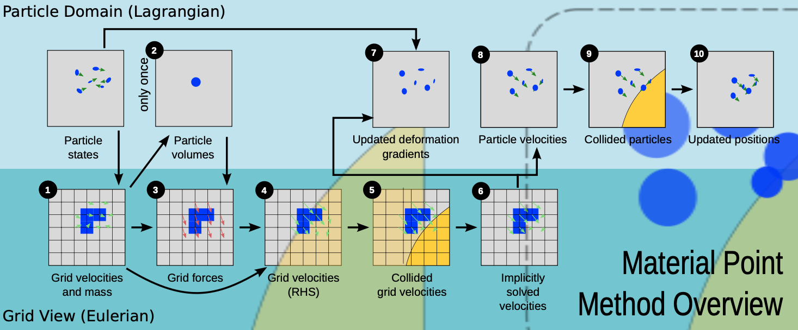

# MPM for snow simulation

 Interpolating functions over this grid are used to discretize the $\nabla \sigma$ terms in the standard FEM manner using the weak form.

##  Overview of MPM

The **Material Point Method (MPM)** is a hybrid Lagrangian-Eulerian method:

- **Lagrangian particles** track:
  - Mass
  - Momentum
  - Deformation gradient

- A **background Eulerian grid** is used to:
  - Compute spatial derivatives (e.g., divergence of stress)
  - Handle collisions and topological changes (e.g., fracture)

This allows MPM to simulate deformable materials undergoing large strains and discontinuities.

---

## Deformation Mapping

A body’s deformation is represented as:

$$
\mathbf{x} = \boldsymbol{\phi}(\mathbf{X})
$$

- $\mathbf{X}$: undeformed (material) coordinate  
- $\mathbf{x}$: deformed (spatial) coordinate  
- **Deformation gradient**:

$$
\mathbf{F} = \frac{\partial \boldsymbol{\phi}}{\partial \mathbf{X}}
$$

---

### Governing Equations

**Continuum mechanics equations** used in MPM:

- **Conservation of mass**:
$$
  \frac{D\rho}{Dt} = 0
$$

- **Conservation of momentum**:
$$
  \rho \frac{D\mathbf{v}}{Dt} = \nabla \cdot \boldsymbol{\sigma} + \rho \mathbf{g}
$$

- **Constitutive relation (Cauchy stress)**:
$$
  \boldsymbol{\sigma} = \frac{1}{J} \frac{\partial \Psi}{\partial \mathbf{F}_E} \mathbf{F}_E^T
  $$

Where:
- $\rho$: density  
- $\mathbf{v}$: velocity  
- $\boldsymbol{\sigma}$: Cauchy stress  
- $\mathbf{g}$: gravity  
- $\Psi$: elasto-plastic potential energy density  
- $\mathbf{F}_E$: elastic part of the deformation gradient  
- $J = \det(\mathbf{F})$

---

### MPM Core Idea

> Use particles (material points) to **track**:
> - mass $m_p $
> - velocity $\mathbf{v}_p$
> - position $\mathbf{x}_p$
> - deformation gradient $\mathbf{F}_p$

This **Lagrangian approach** simplifies mass and momentum updates.

However, since particles have **no mesh connectivity**, it is **hard to compute derivatives** like $\nabla \cdot \boldsymbol{\sigma}$

#### Eulerian Grid for Derivatives

To handle this:
- Use a **background Eulerian grid**.
- Interpolate between particles and grid using basis functions.
- Discretize the divergence terms $\nabla \cdot \boldsymbol{\sigma}$ using **Finite Element Method (FEM)** in its **weak form**.

#### Interpolation Weights

They use **dyadic products** of 1D **cubic B-spline basis functions**:

$$N^h_i(\mathbf{x}_p) = N\left( \frac{x_p - ih}{h} \right) N\left( \frac{y_p - jh}{h} \right) N\left( \frac{z_p - kh}{h} \right)
$$

These weights $w_{ip} = N^h_i(\mathbf{x}_p)$are used for:
- Transferring data **from particles to grid**
- Interpolating results **from grid back to particles**

These interpolation functions naturally compute forces *at the nodes of the Eulerian grid.* Therefore, we must first *transfer the mass and momentum from the particles to the grid* (P2G).

---

## MPM algorithm overview

1. **Rasterize particle data to the grid**

- Transfer **mass** to grid nodes:

$$
m_i^n = \sum_p m_p w_{ip}^n
$$

- Transfer **velocity** to grid using mass-weighted average to ensure **momentum conservation**:

$$
\mathbf{v}_i^n = \frac{ \sum_p \mathbf{v}_p^n m_p w_{ip}^n }{ m_i^n }
$$

> ⚠️ Note: Unlike FLIP for incompressible fluids, we use **normalized** weights for velocity.

---

2. **Compute particle volumes and densities (first step only)**

- Estimate **grid cell density**:
$$
\rho_i^0 = \frac{m_i^0}{h^3}
$$
- Weight back to particle:
$$
\rho_p^0 = \sum_i \frac{m_i^0}{h^3} w_{ip}^0
$$
- Estimate **particle volume**:
$$
V_p^0 = \frac{m_p}{\rho_p^0}
$$
---

3. **Compute grid forces**

Use the stress-based force formula (Equation 6) with:

$$
\hat{\mathbf{x}}_i = \mathbf{x}_i
$$

---

4. **Update velocities on the grid**

Apply explicit or semi-implicit update (Equation 10):

$$
\mathbf{v}_i^* = \mathbf{v}_i^n + \Delta t \cdot \frac{1}{m_i} \mathbf{f}_i^n
$$

---

5. **Grid-based body collisions**

Handle collisions for $\mathbf{v}_i^*$ using level sets as described later.

---

6. **Solve the linear system**

For semi-implicit integration (Equation 9):
$$
\sum_j \left( \delta_{ij} + \beta \Delta t^2 \frac{1}{m_i} \frac{\partial^2 \Phi^n}{\partial \hat{x}_i \partial \hat{x}_j} \right) \mathbf{v}_j^{n+1} = \mathbf{v}_i^*
$$
- Use $\beta = 1$ for backward Euler.
- For explicit updates, just set:
$$
\mathbf{v}_i^{n+1} = \mathbf{v}_i^*
$$
---

 7. **Update deformation gradient**

Compute new deformation gradient for each particle:
$$
\mathbf{F}_p^{n+1} = \left( \mathbf{I} + \Delta t \nabla \mathbf{v}_p^{n+1} \right) \mathbf{F}_p^n
$$

Where:
$$
\nabla \mathbf{v}_p^{n+1} = \sum_i \mathbf{v}_i^{n+1} \left( \nabla w_{ip}^n \right)^T
$$
---

8. **Update particle velocities**

Use a **PIC/FLIP blend** (typically $\alpha = 0.95$):

$$
\mathbf{v}_p^{n+1} = (1 - \alpha) \mathbf{v}_{\text{PIC}, p}^{n+1} + \alpha \mathbf{v}_{\text{FLIP}, p}^{n+1}
$$

- **PIC part**:

$$
\mathbf{v}_{\text{PIC}, p}^{n+1} = \sum_i \mathbf{v}_i^{n+1} w_{ip}^n
$$

- **FLIP part**:

$$
\mathbf{v}_{\text{FLIP}, p}^{n+1} = \mathbf{v}_p^n + \sum_i (\mathbf{v}_i^{n+1} - \mathbf{v}_i^n) w_{ip}^n
$$

---

9. **Particle-based collisions**

Resolve body collisions again on updated particle velocities $\mathbf{v}_p^{n+1}$.

---

10. **Update particle positions**

Move particles forward in time:
$$
\mathbf{x}_p^{n+1} = \mathbf{x}_p^n + \Delta t \cdot \mathbf{v}_p^{n+1}
$$
---

## Constituitive model
**Simplifications of the constituitive model:**
- use of principal stretches rather than principal stresses in defining our plastic yield criteria 
- a simplification of hardening behavior that only requires modification of the Lame parameters in the hyperelastic energy density.

In multiplicative plasticity theory we do:

$$F = F_E F_P$$
and we define the model in terms of elasto-plastic energy density:

$$\Psi(F_E, F_P) = \mu (F_p) \|F_E - R_E\|^2_F + \frac{\lambda(F_p)}{2} (J_E - 1)^2$$
where
-  elastic part is given by the fixed *corotated energy density*
- Lame parameters are function of $F_P$:
	- $\mu(F_P) = \mu_
	0 e^{\eta (1-J_P)} \quad \lambda(F_P) = \lambda_0 e^{\eta (1-J_P)}$

where $J_X = det(X)$ and $F_E = R_ES_E$. Here $\eta$ is the dimensionless plastic hardening parameter.

We define the portion of deformation that is elastic and plastic using the **singular values of the deformation gradient.** We define a critical compression $\theta_c$ and stretch $\theta_s$ as the thresholds to start plastic deformation (or fracture). These two determine *when* the material starts breaking and the hardening coefficient tells us *how fast* it breaks.

> The deformation as such is elastic for some small deformations around the rest state, dictate by $F_E$. After it surpasses some critical treshold the plastic regime kicks in. This makes the material *stronger under compression* (packing) and *weaker under stretch* (fracture).

## Stress Based forces

Using our defined energy density we can define the total elastic potential energy:

$$\int_{\Omega^0} \Psi(F_E(X),F_P(X))dX.$$

MPM spatial *discretization of the stress-based forces* is equivalent to differentiation of a *discrete approximation* of this energy with respect to the *Eulerian grid node* material positions. That said, we do not actually *deform the Eulerian grid* so we can think of the change in the grid node locations as being determined by the *grid node velocities.* If $x_i$ is the position of grid node $i$, then $\hat x_i = x_i +\Delta t v_i$ is the deformed location of that grid node.

Then the MPM approximation to *total elastic potential* from above can be written as:

$$\Phi(\hat x) = \sum_p V_p^0 \Psi(\hat F_{E_p}(\hat x), F_{P_P}^n)$$
where:

- $V^0_p$ is volume occupied by MP in rest state
- $F_{P_p}^n$ is the plastic part of $F$ at particle $p$ at time $t^n$
- $\hat F_{E_p}(\hat x)$ is the elastic part at $p$ . We compute it as:
$$\hat F_{E_p}(\hat x) = \left(I \sum_i (\hat x_i -x_i)(\nabla w_{ip})^n)^\top\right)F_{E_p}^n$$

- $\hat x$ is the vector of all $\hat x_i$.

This gives us **MPM spatial discretization of the stress-based forces**, specifically the force on grid node $i$ resulting from elastic stresses is:

$$f_i(\hat x) = -\partial_{\hat x_i}\Phi(\hat x) =- \sum_p V_p^0 \partial_{F_E}\Psi(\hat F_{E_p}(\hat x), F_{P_p}^n) (F_{E_p}^n)^\top \nabla w_{ip}^n,$$$$ = - \sum_p V_p^0 \partial_{F_E}\Psi {F_{E_p}^n}^\top \nabla w_{ip}^n.$$

Recall that elastic stress can be related to Cauchy stress so we can write:

$$f_i(\hat x) = -\sum_p V_p^n \sigma_p \nabla w_{ip}^n$$
where $V^n_p = J_p^n V_p^0$ and the stress is:

$$\sigma_p = (J_p^n)^{-1} \partial_{F_E}\Psi (F_{E_p^n})^\top.$$
This formulation will help us evolve our grid velocities $v_i$ implicitly in time.

> We can take an implicit step on the elastic part of the update by utilizing the Hessian of the potential with respect to $\hat x$

The action of the hessian on some increment  $\delta u$ is:

$$\delta f_i = - \sum_j \frac{\partial^{2}\Phi}{\partial \hat x_i \partial \hat x_j} (\hat x) \delta u_j = - \sum_p V_p^0A_p (F_{E_p}^n)^\top \nabla w_{ip}^n$$
where 

$$A_p = \frac{\partial^2 \Psi}{\partial F_E \partial F_E}(F_E(\hat x), F_{P_p}^n) : \left(\sum_j \delta u_j (\nabla w_{jp^n}^\top F_{E_p}^n\right).$$

##  Semi-Implicit Update

We define the updated grid node positions as:
$$
\hat{\mathbf{x}}_i = \mathbf{x}_i + \Delta t\, \mathbf{v}_i
$$
Since we never actually deform the grid, we consider $\hat{\mathbf{x}}$ as a function of the grid velocity $\mathbf{v}$, i.e. $\hat x(v)$.

Let:
- $\mathbf{f}_i^n = \mathbf{f}_i(\hat{\mathbf{x}}(0))$
- $\mathbf{f}_i^{n+1} = \mathbf{f}_i(\hat{\mathbf{x}}(\mathbf{v}^{n+1}))$

which gives us $\frac{\partial^2 \Phi^n}{\partial \hat x_i \partial \hat x_j} = - \partial_{\hat x_j}f_i^n$

We approximate the time evolution of velocity with a *semi-implicit integration* scheme:
$$
\mathbf{v}_i^{n+1} = \mathbf{v}_i^n + \Delta t\, m_i^{-1} \left[ (1 - \beta)\mathbf{f}_i^n + \beta\mathbf{f}_i^{n+1} \right]
$$
Now use a *Taylor expansiom* for $\mathbf{f}_i^{n+1}$:

$$
\mathbf{f}_i^{n+1} \approx \mathbf{f}_i^n + \sum_j \frac{\partial \mathbf{f}_i^n}{\partial \hat{\mathbf{x}}_j} \Delta t\, \mathbf{v}_j^{n+1}
$$
Substituting this approximation gives the **update for grid velocities:**
$$
\mathbf{v}_i^{n+1} \approx \mathbf{v}_i^n + \Delta t\, m_i^{-1} \left( \mathbf{f}_i^n + \beta \Delta t \sum_j \frac{\partial \mathbf{f}_i^n}{\partial \hat{\mathbf{x}}_j} \mathbf{v}_j^{n+1} \right)
$$

---

### Linear System

To solve for $\mathbf{v}^{n+1}$, we rearrange terms into a linear system:
$$
\sum_j \left( \delta_{ij} \mathbf{I} + \beta \Delta t^2 m_i^{-1} \frac{\partial^2 \Phi^n}{\partial \hat{\mathbf{x}}_i \partial \hat{\mathbf{x}}_j} \right) \mathbf{v}_j^{n+1} = \mathbf{v}_i^\star
$$
where:
$$
\mathbf{v}_i^\star = \mathbf{v}_i^n + \Delta t\, m_i^{-1} \mathbf{f}_i^n
$$
- Matrix is **symmetric and positive definite**
- Solved efficiently with **Conjugate Residual method**
- Requires ~10–30 iterations per time step

### Deformation Gradient Update

**Step 1:** Predict Elastic Deformation

We compute an initial **trial elastic gradient from the velocity gradient:**
$$
\hat{F}_{E_p}^{n+1} = \left( \mathbf{I} + \Delta t\, \nabla \mathbf{v}_p^{n+1} \right) F_{E_p}^n
$$
Set:
$$
\hat{F}_{P_p}^{n+1} = F_{P_p}^n
$$
So:
$$
F_p^{n+1} = \hat{F}_{E_p}^{n+1} \hat{F}_{P_p}^{n+1}
$$
**Step 2: Clamp Excess Deformation**
Now  we take the part of the elastic $F$ that exceeds the critical deformation threshold and push it into plastic $F$. We perform SVD on the trial elastic part:
$$
\hat{F}_{E_p}^{n+1} = U_p \hat{\Sigma}_p V_p^T
$$
Clamp singular values to the allowed range:
$$
\Sigma_p = \text{clamp}(\hat{\Sigma}_p, [1 - \theta_c, 1 + \theta_s])
$$
**Step 3: Redistribute Deformation**

We update the elastic and plastic parts as:

$$
F_{E_p}^{n+1} = U_p \Sigma_p V_p^T
$$

$$
F_{P_p}^{n+1} = V_p \Sigma_p^{-1} U_p^T F_p^{n+1}
$$

So the decomposition satisfies:

$$
F_p^{n+1} = F_{E_p}^{n+1} F_{P_p}^{n+1}
$$

- Excess deformation (beyond yield) is moved from elastic to plastic part
- Guarantees energy is dissipated through plastic flow
- Keeps elastic stress in a physically valid range
