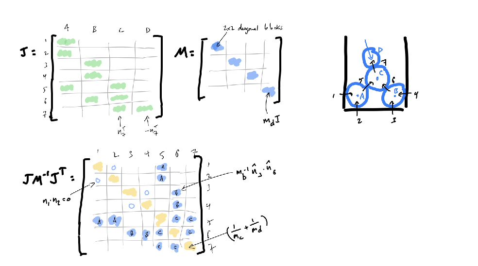

# Rigid Body Dynamics


## 2D 

When describing motions of rigid bodies in 2D we want to describe their position, their orientation and their velocity. We can 
represent the orientation of the body as a square matrix $R$. This gives a mapping between world and body coordinates:

$$r_w = x + R r_b$$

where $r_w$ is the world coordinates, $r_b$ is the body coordinates and $x$ is the position of the center of mass. $R$ can in 
2D be represented as $q = [c, s]^\top$ where $c$ is the cosine of the angle and $s$ is the sine of the angle. In 3D we have a similar
representation using unit quaternion $q= [w, x, y, z]^\top$ s.t. $R(t) = R(q(t))$.

The motion of a point on the moving body is given by:

$$r(t) = x + R(t)r_b$$
$$ \dot r(t) = \dot x(t) + \dot R(t) r_b = v(t) + \dot R(t) r_b$$

so $\dot R$ maps a body-space point to the rotational part of its world-space velocity. Rotation matrices are orthogonal so we have $RR^\top =R^\top R = I$. The derivative of this is an asymettric matrix so there exists a $\omega$ .s.t. $\dot R ^\top Rx = \omega \times x$, so we say $\omega^\times = \dot RR^\top$ and so $\dot R = \omega^\times R$.  We find that $\dot R$ is a special matrix s.t. 

$R = \omega^\times R$ where $\omega^\times = \begin{bmatrix} 0 & -\omega \\ \omega & 0 \end{bmatrix}$. And since $q$ is the first column of $R$ we get:

$$\dot q = \omega^\times q = \omega \times q.$$

So then the update in Euler integrator would be:

$$x_{k+1} = x_k + h v_k$$
$$q_{k+1}$ = \frac{q_k + h (\omega \times q_k)}{\|q_k + h( \omega \times q_k)\|}.$$

In 3D this gets a little more complicated, because $q$ is a quaternion and we have $\dot q = 1/2 \omega q$. So the update in Euler would be:

$$x_{k+1} = x_k + h v_k$$
$$q_{k+1} = \frac{q_k + h \frac{1}{2} \omega q_k}{\|q_k + h \frac{1}{2} \omega q_k\|}.$$


So to track velocity of a rigid body we need to track $\dot x$ and $\omega$ and then we can get

$$\dot r = \dot x + \dot R r_b = v + \omega^\times R r_b = v + \omega^\times (r - x).$$


Now that we have the velocities and positions through time, we can calculate the kinetic energy of the body with velocity $v$. We can get it by integrating *energy density* over the body:

$$T = \int \frac{1}{2} \rho(x) v(x)^2 dA(x) = \frac{1}{2}m v^2$$
where $\rho(x)$ is the density of the body at $x$ and $dA(x)$ is the area element at $x$. It can be rewriten as:


$$ =\frac{1}{2} v \dot mv = \frac{1}{2} vp,  $$

where $p$ is the linear momentum of the body. Do we get something similar if the body instead has angular velocity $\omega$? We can write the rotational kinetic energy as by integrating over angular kinetic energy of each piece of mass on the body:

$$T = \int \frac{1}{2} \rho(x) r^2 \omega(x)^2 dA(x) = \frac{1}{2} \omega^T I \omega$$

where $I = \int \rho(r) r^2 dA$ is the inertia tensor—total body mass weighted by squared distance from origin—and we can rewrite the above as:

$$T = \frac{1}{2} \omega^T I \omega = \frac{1}{2} \omega \dot L = \frac{1}{2} L \omega$$

where $L = I \omega$ is the angular momentum of the body.


We now see that state of a rigid body can be represented as $x,q,\dot x, \omega$. The linear and angular
momentum are given by $p = m \dot x$ and $L = I \omega$ where $I$ is the inertia tensor, where the moment of inertia is given by:

$$ I = \int \rho(x) x^2 dA(x)$$

where $\rho(x)$ is the density of the body at $x$ and $dA(x)$ is the area element at $x$. The (total) kinetic energy of the body with 
linear velocity $v$ and angular velocity $\omega$ is given by:

$$ T = \frac{1}{2} m v^2 + \frac{1}{2} \omega^T I \omega/$$


Now in 3D, the moment of inertia depends on what axis the rotation is happening around. The velocity $v(r)$ depends on both the rotation speed and the distance from the axis, so $v^2(r) = (\omega\times r)^2$ which can also be written as:

$$v^2(r) = \omega^\top (r^\top r) \omega - \omega^\top (rr^\top) \omega^\top.$$

We can again compute kinetic energy if the angular velocity is $\omega$:

$$E_k = \frac{1}{2}\int \rho(r)v^2(r)dV = \frac{1}{2} \omega^\top I \omega$$

which in terms of $\|omega\|$ can be expressed as $T = 1/2 \hat omega^\top I \hat omega \times \|\omega\|^2$. Compared to rotation in 2D we can see that the inertia depends on the axis $\hat \omega$. $I$ here is inertia tensor, teling us moment of inertia around any rotation axis. Again, $I\omega$ is the angular momentum.


$$f = m \dot v = \dot p$$ immediately affects the translational velocity of the body. Depending on the point of application of the force, the body will also start to rotate so the force will create angular acceleration / momentum. If we are applying it $r' = r-x$ from the center of mass, the effect is proportional to $\|'r\|$, so we can define the torque as $r' \times f$. In terms of the inerta tensor, we can write the torque as $I \dot \omega = \tau = \dot L$. So torque is essentially a force that creates angular momentum acceleration.


These impulses cause instantaneous changes in the linear and angular velocity of the body: $m\Delta v = j$ and $I\Delta \omega = r' \times j$.

$$v^+ = v^- + m^{-1}j$$
$$\omega^+ = \omega^- + I^{-1}r' \times j.$$


In 2D and 3D we have $r' \times j = \Delta L$ and $=I\Delta \omega$ iff in 2D.


**Collisions.** How do we model collision of a rigid body with a fixed obstacle? Assuming we know the point of contact, we want to apply an impulse at the point of contact so that the velocity in the normal direction is some negative multiple of the incoming normal velocity $v^+_ = - c_rv_n^-$.
Considering the total velocity in the normal directions before the collision:

$$v_n^- = \hat n \cdot (v_t^- + \omega^- \times r').$$

We call the direction along which we want to apply the impulse $j=\hat n \gamma.$ After the collision we then have updated translational and angualr velocities:

$$v_{t,n}^+ =v^-_{t,n} + \gamma a = v^{-}_{t,n} m^{-1}j $$
$$\omega^+ = \omega^- + I^{-1}r' \times j.$$

But what is $\gamma$? We can find it by comparing velocities before and after:

$$\gamma = -(1+ c_r)m_{eff}v_n^-.$$


Now, what if we have two bodies $A,B$ colliding at some point? If the velocity of contact point on $A,B$ is:

$$v_A = v_a  + \omega \times r_a$$
$$v_B = v_b  + \omega \times r_b$$

then we can find the relative normal velocity of the point of contact:
$$v_n =  \hat n \cdot (\Delta v + \Delta \omega \times r) = \hat n \cdot (v_a - v_b + \omega \times r_a - \omega \times r_b).$$


Again, using restitution hypothesis we want $v_n^+ = -c_r v_n^-$. If we apply some impulse $j$ to the point of contact, then the changes in 
velocities will be:

$$\Delta v_a = m_a^{-1}j,$$
$$\Delta v_b = -m_b^{-1}j,$$
$$\Delta \omega_a = I_a^{-1}r_a \times j,$$
$$\Delta \omega_b = -I_b^{-1}r_b \times j.$$

We want the impulse along the normal $j = \gamma \hat n$ so writing the new total velocity in normal direction after the impulse in terms of previous velocity we find $\gamma = -(1+c_r)m_{eff}v_n$.


As a recap, to deal with isolated collisions between objects $A,B$ we can do the following:

1. Detect collisions and determine the collision point $x$ and normal $\hat n$.
2. Compute the relative collision offset $r_A = x - x_A$ and $r_B = x - x_B$.
3. Compute $m_{eff}$ and $\gamma$
4. Apply impulses to the bodies to get new velocities $v_{a,b}^+ = v_{a,b}^- + m_{a,b}^{-1}\gamma \hat n$.
5. Update angular velocities $\omega_{a,b}^+ = \omega_{a,b}^- + I_{a,b}^{-1}r_{a,b} \times \gamma \hat n$.


## Resolving Systems of Collisions.

What if we have multiple bodies colliding at the same time? We can resolve them in a sequential manner, where we resolve one collision at a time. How does this arise? Resting contact, deformable vs rigid. The problem with rigid and deformable bodies is that the deformable body can change shape and volume, so we need to resolve the collisions in a sequential manner. But rigid bodies instantly transmit the impulse.


**Collision Response Between Two Objects.**
For two spherical particles $$ A $$ and $$ B $$, the collision response is derived using the **restitution hypothesis**, which states that the post-contact normal velocity is opposite to the pre-contact normal velocity, scaled by the coefficient of restitution $$ c_r $$. Mathematically:

$$
v_1^+ = -c_r v_1^-, \quad v_1 = \mathbf{n}_1 \cdot (\mathbf{v}_a - \mathbf{v}_b)
$$

The impulses applied to the particles are:

$$\mathbf{v}_a^+ = \mathbf{v}_a^- + m_a^{-1} \gamma_1 \mathbf{n}_1,$$

$$\mathbf{v}_b^+ = \mathbf{v}_b^- - m_b^{-1} \gamma_1 \mathbf{n}_1,
$$

where $$ m_{\text{eff}} = (m_a^{-1} + m_b^{-1})^{-1} $$ is the effective mass. The impulse magnitude $$ \gamma_1 $$ is given by:

$$
\gamma_1 = -m_{\text{eff}} (1 + c_r) v_1^-.
$$

### Extending to Multiple Collisions

When an object is involved in multiple simultaneous collisions, its velocity is influenced by all related impulses. For instance, if particle $$ B $$ is also in contact with particle $$ C $$, and we know the impulse $$ \gamma_2 $$ for collision 2, the updated velocity of $$ B $$ becomes:

$$
\mathbf{v}_b^+ = \mathbf{v}_b^- - m_b^{-1} \gamma_1 \mathbf{n}_1 + m_b^{-1} \gamma_2 \mathbf{n}_2.
$$

Propagating this change through, the impulse for collision 1 becomes:

$$
\gamma_1 = m_{\text{eff}}(- (1 + c_r) v_1^- + m_b^{-1} \gamma_2 (\mathbf{n}_1 \cdot \mathbf{n}_2)).
$$
We see that the impulse for collision 1 depends on the impulse for collision 2. That is, the impulse calculation is the same except we add a correction for the effect of the other
impulse on $B$’s velocity in the $\hat n_1$ direction.

For a system with many collisions, we generalize this to include contributions from all other impulses:

$$
\gamma_i = m_{\text{eff}, i}\left(- (1 + c_r) v_i^- - m_a^{-1} (\mathbf{n}_i \cdot \gamma_{ia}) + m_b^{-1} (\mathbf{n}_i \cdot \gamma_{ib})\right),
$$

where:

$$\gamma_{ia} = \sum_{j \neq i} s_{ja} \gamma_j \mathbf{n}_j,$$
$$\gamma_{ib} = \sum_{j \neq i} s_{jb} \gamma_j \mathbf{n}_j.$$

Here, $$ s_{jx} = +1/-1/0 $$ depending on whether object $$ X $$ is the first/second/not involved in collision $$ j $$.

#### Iterative Algorithm for Collision Resolution

To resolve multiple collisions iteratively:
1. Compute prospective velocities for all objects.
2. Detect all collisions and initialize all impulses ($$ \gamma_i = 0$$).
3. While not converged:
   - For each collision $$ i $$:
     - Compute $$ \gamma_i $$ using current values of other impulses.
     - Clamp $$ \gamma_i \geq 0.$$
     - Apply all impulses to update velocities.
4. Optionally, add a small "nudge" proportional to overlap depth to correct penetration errors.

This iterative approach ensures convergence under most conditions.

---

### Matrix Formulation of Collision Resolution

The iterative process can be reformulated as a matrix problem for efficiency and theoretical guarantees. While this is more abstract, it can be more efficient for large systems, since our collisions resolution is just an interative solver of a linear system.

**Jacobian Matrix.**
The Jacobian matrix $$ J $$ maps object velocities to normal velocities at contact points. For a system of $$ N $$ objects and $$ k $$ collisions:

$$
v_i = J_iv,
$$

where:
- $$ v_i^- = Jv^- , v_i^+ = Jv^+,$$
- $$ J v^+ = J v^- + J M^{-1} J^T \boldsymbol{\gamma},$$
- $$ M^{-1} J^T$$  is impulse .


**Velocity Changes.**
We can express the velocity changes due to collision impulses in matrix form:
$$v^+ = v^- + M^{-1}J_1^\top\gamma_1,$$

for the $1^{st}$ collision. The velocity changes due to all collisions can be written as:

$$v^+ = v^- + M^{-1}J_1^\top\gamma_1 + M^{-1}J_2^\top\gamma_2 + \ldots + M^{-1}J_k^\top\gamma_k,$$
$$v^+ = v^- + M^{-1}J\gamma,$$

where $k$ is the number of collisions and $\gamma$ is a $k$ column vector of impulses. Now its pretty simple to get:

$$v_n^+ = Jv^+ = Jv^- +JM^{-1}J^\top \gamma$$. By restitution hypothesis we have $v_n^+ = -c_r v_n^-$ so we can write:

$$Jv^- +JM^{-1}J^\top \gamma = -c_r Jv^-$$
$$JM^{-1}J^\top \gamma = -(1+c_r) Jv^-,$$
$$A\boldsymbol{\gamma} = \boldsymbol{b},$$

and this is just a simple $k\times k$ linear system that we can solve for $\boldsymbol{\gamma}$.
This means that *if* our matrix $A$ is non-singular, then we are good! Turns out, this is not always the case. 

**Sparsity of the Matrix.** The matrix A is typically sparse, especially in systems with many objects and collisions. This sparsity can be exploited to improve the efficiency of solving the linear system.

Consider a system with 7 objects and some fixed walls. The matrix A will have non-zero entries only where objects are involved in collisions.



Each row and column corresponds to a collision. Non-zero entries indicate interactions between collisions involving the same objects.

So even though we want to solve $A\boldsymbol{\gamma} = \boldsymbol{b}$, we don't really want to solve it always... we don't want $\boldsymbol{\gamma}$ to be negative, so we can use a projection method to project it to the positive space. If it would be negative, then we want to set it to 0 and let $v_i^+ > -c_r v_i^-$. This essentially gives us a pair of *complementary constraints* for each collision $i$:

$$\gamma_i > 0 \text{ and } A_i\gamma -b_i = 0$$
$$A_i\gamma - b_i >0 \text{ and } \gamma_i = 0.$$


This is called **Linear complementarity problem,** or LCP. You may sometimes see it written as:

$$A \lambda  + b \geq 0, \quad \lambda_{lo} \leq \lambda \leq \lambda_{hi}.$$

To solve the linear system we can use iterative methods that are efficient for large, sparse matrices, such as Gauss-Seidel.

**Projected Gauss-Siedel.** Using the LCP formulation, we can solve the linear system iteratively using the Projected Gauss-Siedel method. This method iteratively updates each impulse, projecting it to the positive space if it becomes negative. The algorithm for $Ax=b$ is:

```
While not converged:
  For each collision $$ i $$:
    find $x_i$ assuming all $j \neq i$ are known.
    row $i$ gives: $a_{ii}x_i + \sum_{j \neq i} a_{ij}x_j = b_i$.
    solve for $x_i= (b_i - \sum_{j \neq i} a_{ij}x_j)/a_{ii}$.
```
  
Replacing $x_i$ with $\gamma_i$ and $A$ with $JM^{-1}J^\top$ and $b$ with $-(1+c_r) Jv^-$, we get the Projected Gauss-Siedel method for LCPs. 


$$\gamma_i = m_{\text{eff}} \left( -(1 - c_r) v_i^- - m_a^{-1} \sum_k s_{ak} \gamma_k \hat{\mathbf{n}}_k \cdot \hat{\mathbf{n}}_i + m_b^{-1} \sum_k s_{bk} \gamma_k \hat{\mathbf{n}}_k \cdot \hat{\mathbf{n}}_i \right)$$

If we were dealing with friction on multidimensional bodies, then insated of clamping $\gamma_i$ to 0 we would project it:
$$\gamma_i = \min(\max(\lambda_{lo}, \gamma_i), \lambda_{hi}).$$


The nice thing about this is that we see that we can use PGS convergence theory for out collision responses.


**Rigid bodies, again.** We can now write changes in velocity of body $a$ if there are multiple collisions in the system as:


$$\delta v_a = m_q^{-1} \gamma_i \hat n_i + m_a^{-1}\sum_{j\neq i} s_{ja}\gamma_j \hat n_j,$$
$$\delta v_a = \delta v_a^{self} + \delta v_a^{other}.$$

where $s_{ja} \in \{-1,0,1\}$, and is -1 if body $a$ is the second body in collision $j$, 1 if it is the first body, and 0 if it is not involved in the collision. The post-collision velocity now has more terms:

$$\boldsymbol{v}_{rel}^+ = \boldsymbol{v}_{rel}^- +(\delta \boldsymbol{v}_a + \delta \omega_a \times r_{ia}) - (\delta \boldsymbol{v}_b + \omega_b \time r_{bi}),$$
which is the velocity from before but we add: 
$$ \dots + \delta v_a^{other} - \delta v_b^{other} + \delta \omega_a^{other}\times r_{ia} - \delta \omega_b^{other} \times r_{bi}.$$
They also propagate into relative normal velocity $v_i^+ = \hat n_i \cdot \boldsymbol{v}_{rel}^+$. 

Solving for the impulse $i$ we see that it depends on the impulse of there was only collision $i$ plus some correction for all other collisions affecting these two objects:

$$\gamma_i = -m_{eff,i} \left[(1+c_r)v_i^- + \hat n\cdot (\delta v_a^{other} - \delta v_b^{other} + \delta \omega_a^{other}\times r_{ia} - \delta \omega_b^{other} \times r_{bi})],$$ where you can recall that $\gamma_i = -m_{eff,i}(1+c_r)v_i^-$, if there was only collision $i$.

This leads to an iterative algorithm in exactly the same way as with particles
- compute each collision impulse magnitude assuming the other impulses are correct
- iterate in Gauss-Seidel fashion
  - this means the new value of each $\gamma$ is used in computing all subsequent $\gamma$s
- project to account for non-pulling constraint
  - this means every computed $\gamma$ gets clamped at zero


### Matrix formulation.
If we write generalized velocities as $u = [v_1, \omega_1 ,\dots, v_n, \omega_n]^\top$ and impulses as $j = [\gamma_1, \dots, \gamma_k]^\top$ then we can write the relative velocity as:

$$v_{i,rel} = J_i u,$$

for $i^{th}$ collision, where $J_i = [\hat_i^\top , (r_i\cross \hat n)^\top,  -\hat n_i, -(r_i\cross \hat n)^\top]$ and so the non-penetration constraint is just $J_i u \geq 0$.

So if we stack all $J_i$ as rows into $\boldsymbol{J}$ we get the updated state velocity:

$$u^+ = u^- + M^{-1}J^\top \lambda_i + \dots = u^- + M^{-1}\bodlsymbol{J}^\top \lambda,$$ 
$$v_n^+ = -c_r v_n^-$$
$$Ju^+ = -c_r Ju^- = Ju^- + JM^{-1}J^\top \lambda$$ 


where $M$ is the mass matrix and $J$ is the Jacobian matrix. This gives us the system $JM^{-1}J^\top \lambda = -(1+c_r)Ju^-$.

 The principle of virtual work requires the
constraint force to be orthogonal to the constraint so $f_i = J_i^\top \lambda_i = 0$ where $\lambda_i$ is actually viewed as a Lagrange multiplier. Physics
requires the normal force to be repulsive and zero at separation,
which yields the complementarity constraint $\lambda_i \geq 0$ and $f_i \geq 0$.


.